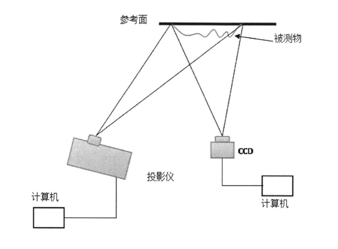
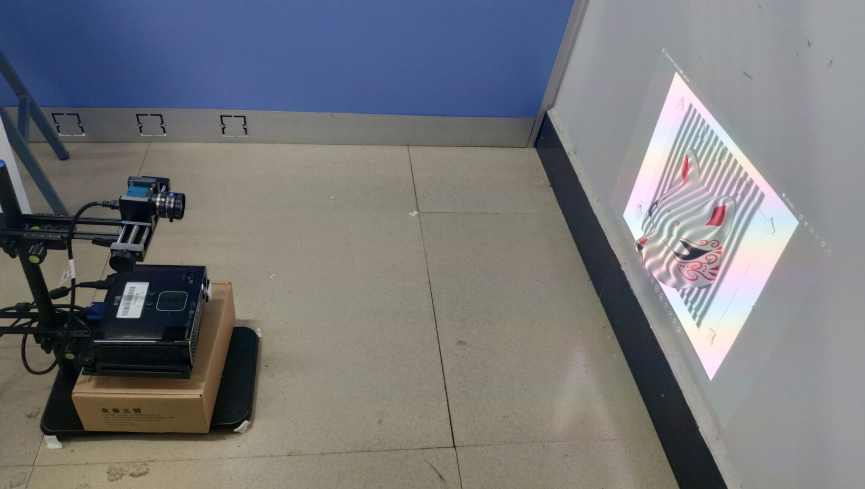

# 关于

> 介绍一下我写这个分享的原因吧

[[toc]]

## 关于我

我是一个什么样的人呢？其实我也不是很了解自己。

## 关于这篇分享

### 前言

在我刚接到这个课题的时候《**基于HALCON的光栅投影快速三维检测的研究**》我其实脑子是懵的，对的，虽然在此之前我也接触了半年多的halcon，但是只是一些简单的二维<Badge text="天堂" type="warn"/>图形的一些检测而已，一下子难度升级到三维<Badge text="地狱" type="error"/>，心里MMP。

### 过程

- 从19年4月1号开始，我辞职了:no_mouth:，回到学校:confounded:，此时的我感到很时间很紧迫，因为身边的同学大多论文都写了七七八八的，就我还没开始，连准备工作很没有。
- 其实内心很:cry:。
- 我的速度就跟:snail:一样。

然后我跟自己说，给自己一个月的时间，每天就泡在实验室好了:sunglasses:，吃可以点外卖:ghost:，住可以睡躺椅:jack_o_lantern:，每天拿出:100:的精力去战斗:rocket:!<Badge text="Fight++" type="error"/>

于是乎，开启了我长达一个月的战斗！

### 什么不会学什么

- 1.从标定开始，研究相机标定，搜了很多文章，后面发现[张正友标定法](https://blog.csdn.net/u010128736/article/details/52860364) <Badge text="推荐"/>是最好用的。
- 2.再从光栅投影三维检测入手，在知网、万方、维普、百度学术，反正各种地方一直找很多研究文献，然后全部下载下来，整理好。
- 3.资料收集的差不多，就是开始啃骨头了，哇，原理部分真的是让人要死要死的，一度感觉脑袋要爆炸，这是什么鬼？什么单目视觉、双目视觉、莫尔条纹、三步、四步相移法等等各种原理轰炸一波。然后确认用的是相位轮廓术（四步相移法）。[三维检测技术各大原理](./guide/principle.md) <Badge text="戳一戳" type="warn"/>
- 4.开始理解四步相移法的原理，哇一个公式又臭又长，如下咯
 <Badge text="心态爆炸" type="error"/>
 <Badge text="+1" type="error"/>
- 5.真的会发现，以前的学的公式都是幼儿园级别的。这一个公式光理解就要好几天。。。
- 6.原理理解的差不多了，就可以开始撸了，实验系统平台的搭建也是很复杂，搞了我很久。
- 这个是理想图

- 这个是实际图

- 7.原理部分最好理解的，也就是骨头最不硬的部分应该是 [生成光栅并且投影](./guide/raster-generation.md) <Badge text="戳一戳" type="warn"/> 超简单，一两天搞定。
- 8.然后按照级别，标定应该是算中等难度的。

### :tada::tada: 喜欢这篇文章你就给个star :star2:

:star2: :star2: :star2: :star2: 项目地址 :arrow_right: [Github](https://github.com/pengqiangsheng/halcon) :+1:

### 努力更新中 <Badge text="2019.10.24"/> 
:pig_nose:  :pig_nose:  :pig_nose:  :pig_nose:

