# 更新github上的项目
***
## 一.克隆代码
### 准备工作：1.[git客户端](https://git-scm.com/download/win) 2.[github账户](https://github.com)		 

### 1.在本地建立一个文件夹，在此处点击右键，选择git bash here

+ 进入此文件夹
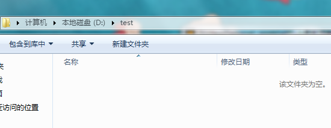
+ 右键选择git bash
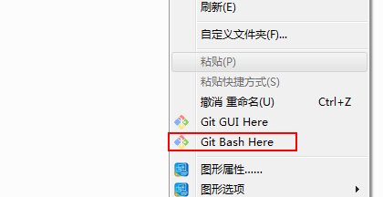

### 2.把自己的代码clone到本地，或者clone别人的到本地
>`$ git clone https://github.com/xxx`
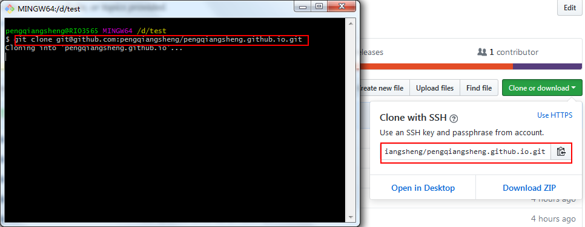

### 3.clone完成后查看本地代码
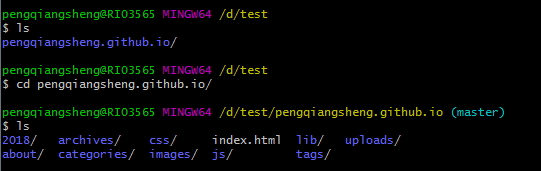

## 二.更新代码

### 1.新增一个mytest的文件夹，里面有一个my.txt

+ 新建文件夹 `$ mkdir mytest`
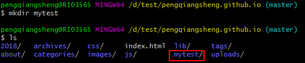
+ 创建my.txt `$ touch my.txt`
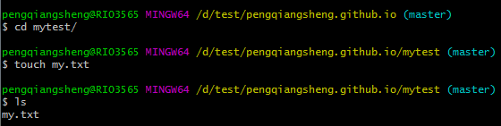

### 2.使用git status命令查看状态
#### 查看当前git仓库状态，发现有新的文件
>`git status`
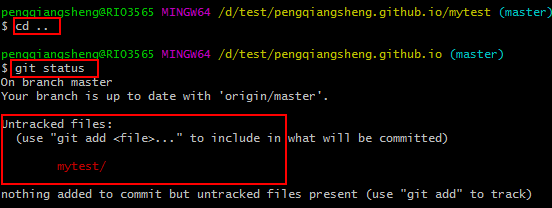

## 三.更新代码

### 1.使用git add命令 
>`$ git add *` --代表更新全部
### 2.使用git commit -m "更新说明",commit只是提交到缓存区域
>`$ git commit -m "更新说明"`
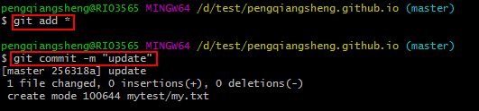
### 3.如果多人同时开发维护代码，得先git pull,拉取当前分支最新代码
>`$ git pull`
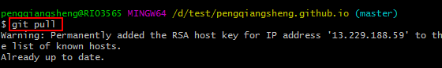
### 4.最后git push origin master,最后一步才是push到远程master分支上
>`$git push origin master`
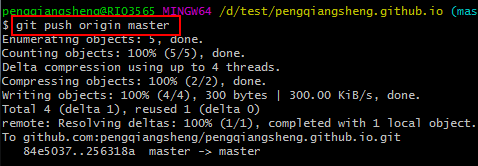
### 5.打开github界面查看到更新状态
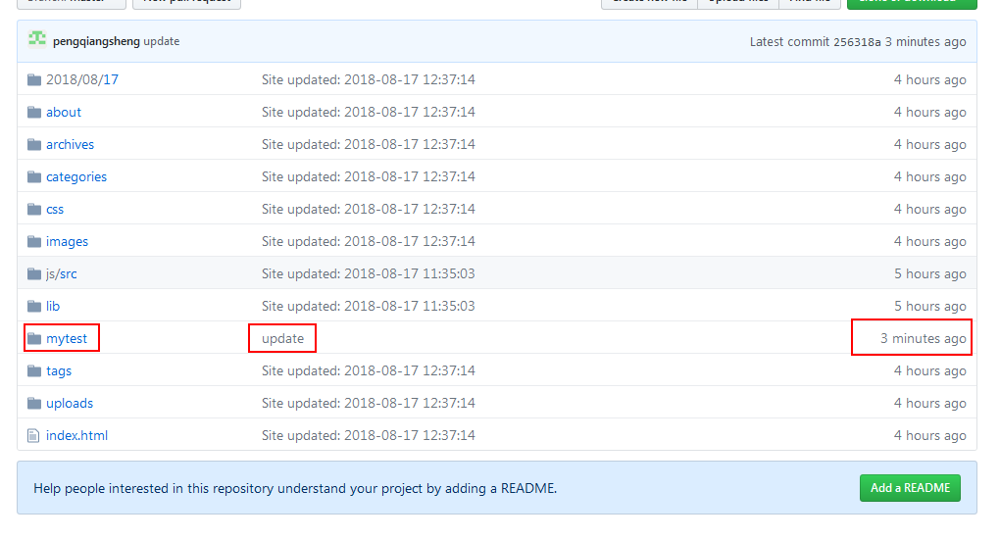