# 横向对比Element-tree、ztree、ivew-tree性能对比分析与源码修改自定义组件

## 一、前言

> 公司的树业务复杂的一批，而且数据量十分大，动不动测试就说最少测上w条数据，我顶个狒狒。

公司的中后台系统用的是Element-UI框架，自然树组件也就是用的el-tree。

说实话，el-tree已经很不错了，提供丰富的回调事件，属性，方法，在轻量数据渲染上可以说是不二之选。

但是奈何半年多的项目实践，越发觉得el-tree卡顿了起来，数据越来越多，功能越来越复杂。

测试提这方面的BUG已经到了测必提的境界，优化树组件性能势在必行！！!

> 寻找一条通往光明的道路。


## 二、可以胜任上W条数据渲染的Tree

### 2.1 vue-giant-tree

于是擅长找资源的我，找啊找，咦，找到一个很霸气的家伙：


你看它牛的，轻松实现海量数据的高性能渲染。

> 关键词：轻松、海量、高性能

还解释了为什么要用这玩意：


> 来来来，有不服气吗？ ===》 [big-tree.json](https://refined-x.com/Vue-Giant-Tree/mock/big-tree.json)


彭大师表示不服，安排！

首先把这个号称big-tree的json下载下来看看是真是假！！

> 大小


> 内容


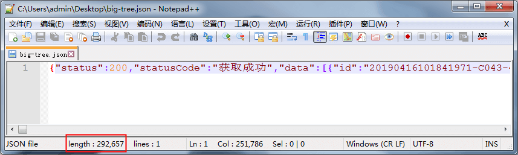


一顿git clone操作，先是yarn，然后serve跑起来，F12按一按。

> 肉眼看：加载的非常快！眨眼之间！

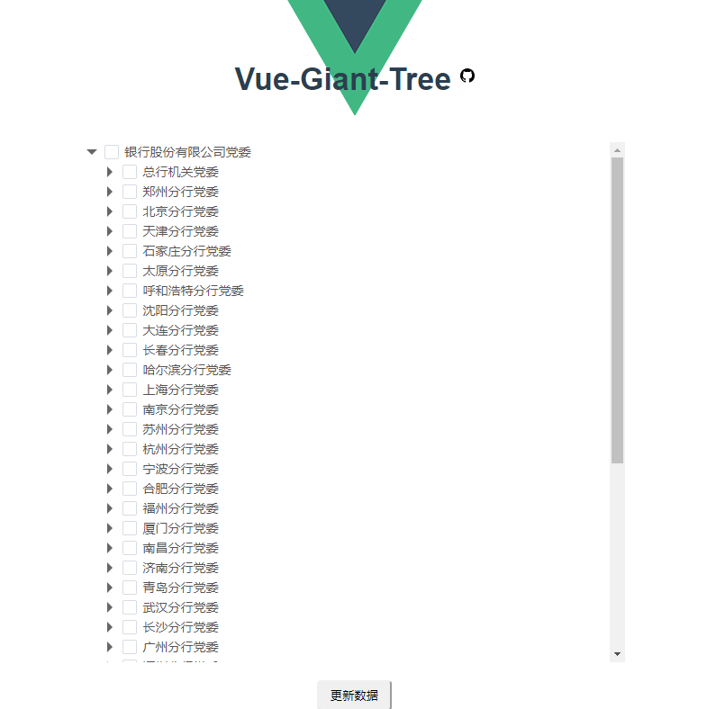

> 看下dom加载：

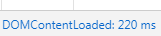


??? 


确实牛逼啊！！！

但是这个vue-giant-tree就像它自己说的那样，仅仅是套了一层ztree的壳，修改下皮肤，所有的功能都是ztree的，所以我去ztree官网仔细看了一下文档。

仔细研究后，发现ztree确实牛逼！！可以在IE6运行且性能十分棒，但是它的icon图标十分的简陋，而且采用是的雪碧图方式，用绝对定位去获取每个图标，这点不符合我们公司的业务需求，咱们要的是好看的，漂亮的，可随时更换的图标。

公司的UI小姐姐，说提供一份位置一样大小一样的雪碧图有难度，不一定能搞出来。

于是我打消了这个念头，决定修改ztree源码采用iconfont形式去获得灵活且丰富的icon配置。

### 2.2 来来来，站在巨人的肩头上

> 牛顿曾言：我之所以这么成功，是因为我站在巨人的肩膀上！


我彭大师如今脚踩vue-giant-tree和ztree，产出了可以胜任业务复杂又要海量数据渲染的vue-magic-tree!

当当当！！！

- GitHub链接：[**vue-magic-tree**](https://github.com/pengqiangsheng/vue-magic-tree)
- 线上测试地址：[测试](http://tree.inner.ink/)


> 亮眼表现：

- 1.卖相十佳，采用vue-giant-tree的漂亮皮肤。
- 2.提供iconfont图标库，任意渲染任意节点类型的图标。

> 随机渲染多种icon图表

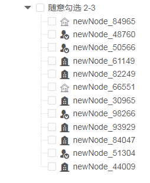


这样，这颗参天大树就满足了业务复杂程度为O(n * n)的业务了。

介绍以下业务：

- 1.默认展开某个分支的某个节点下的所有节点。（一句话说，我想要这个展开，那个不展开，这个展开到多少层，那个又多少层，项目经理吃屎）
- 2.每种节点类型都要有相应的icon图标，有的节点不需要。
- 3.渲染上w条数据不能有“正在刷新的状态”（项目经理吃屎）
- 4.还有一系列要求，我就不展示了。

> 光上上面3点，el-tree退出游戏，i-tree退出游戏。

有的童鞋可能会说，el-tree和i-tree都有提供自定义渲染功能，也能实现icon图标自定义啊。这样说的同学你可以试试，数据量多的时候，有多卡。而且通篇文章只比较初始化加载时间，根本没有比较勾选事件。我们公司的el-tree在3000条数据然后点击全选（点击根节点的checkbox）就要卡2-3秒，每次取消、勾选、取消、勾选，卡的一匹。

不相信的话，我只能说你自己体会。

接下来看性能对比测试，不想看的同学可以点击直达[源码修改章节](#heading-9)


## 三、摆个擂台挑战下（初始化渲染树）

规则说明：

1.同样一份文件，本地加载（ivew的节点名称必须为title, 所以iview那份数据中的name都改成了title, 看我github仓库代码可以看到iview加载的不是全局这份数据，但是是一样的。）

```
const bigData = require("@/mock/big-tree.json");
```
2.同样适用清空缓存重新刷新。

3.gif同样的位置，大小，比率。

> 保证了一致性，可以明显看出，iview和element加载明显有卡顿，而ztree几乎没有延迟。


线上测试地址：[测试](http://tree.inner.ink/) （海外服务器加载可能比较慢）

### 3.1 我尊贵Vip iview表示不服!


### 3.2 我平头哥element表示不服!


### 3.3 Ztree 牛逼


### 3.4 结果分析

> 牛批！！

我要说下这份数据是一个一维的数组，ztree根据pid自动拼接成一颗树形结构的数据然后渲染，还这么出色！！！

而且ztree的功能异常丰富，可以满足你一切需要，你要自己看文档，结合你的业务去开发。

我在这里只是想说ztree牛逼！！！


## 四、对ZTree动手动脚

> 嘿嘿，油头蓬面大叔来了


> 十八禁哈

既然知道这颗树如此优秀核心还是在于ztree，那么咱们就把它的开源代码下载下来，搞起来！！！


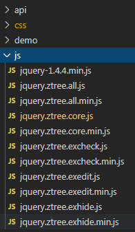

> 这就是ztree的源码（JQuery zTree v3.5.41）

可以看到目录结构很简单，实现**ztree**的都在这个**js**文件夹中。（所以只聚焦关注这个文件夹）

### 4.1 从命名分析

一共十一个文件，（按顺序）第一个是jquery的min版（不管不看）。然后粗略看了眼，带min的文件都给它忽略掉！

这样就剩下5个文件：

```js
jquery.ztree.all.js
jquery.ztree.core.js
jquery.ztree.excheck.js
jquery.ztree.exedit.js
jquery.ztree.exhide.js
```

从命名上看，很清晰了其实：

- all应该是所有功能的集合。
- core就是核心功能。
- ex开头的都是扩展功能。

因为引入项目的是all文件，其实只看all就行了哈。（all包含了core和ex的所有）

动手！！！

因为咱们需要改变它陈旧古老的icon节点，所以从[文档](http://www.treejs.cn/v3/faq.php)入手

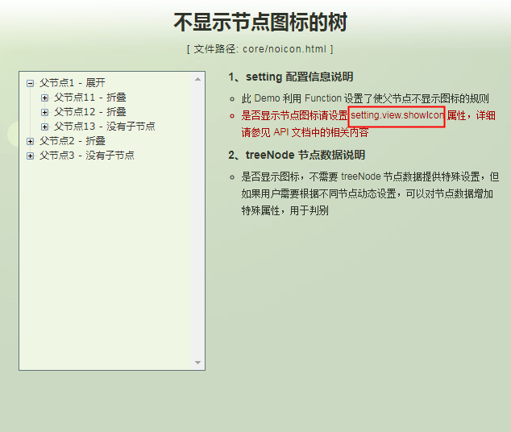

> 我们可以找到控制节点图标的功能设置是通过一个叫做setting.view.showIcon变量控制的

**setting.view.showIcon**: 控制节点图标显示与否。

那么咱们就看看这玩意在源码中是怎么处理逻辑的，从而找到突破口。


### 4.2 从全局看

打开all文件：其实里面备注什么都很详细和完善。

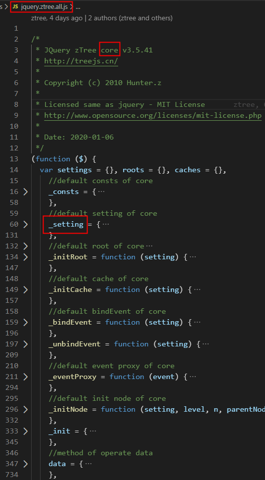

定义了：
- _consts常量
- _setting默认配置对象
- 一些初始化方法_init*,
- 事件绑定和解绑（_bingEvent、_unbindEvent），事件代理(_eventProxy)。

继续往下看：

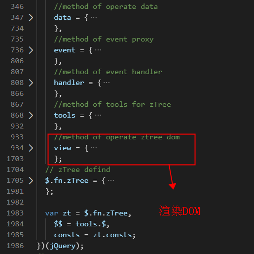

定义了：
- 操作数据的方法集合（data）
- 事件代理的方法集合（event）
- 事件处理的方法集合（handler）
- 为ztree提供公共方法的结合（tools）
- 渲染DOM的方法集合（view）
- ztree的定义

其实很明了，我们想要修改icon图标所在的那个dom，所以就看view底下的方法即可；亦可用搜索**showIcon**关键字来找到对应方法的位置。不过先以大局观看整个项目比较好，这样脑子里有一个程序设计的完整的流程和生命周期这样的概念。


### 4.3 查看view底下的方法：

共计30-40个方法（粗略数了一下）

首先不要慌，先看函数名，相信自己能够看懂。

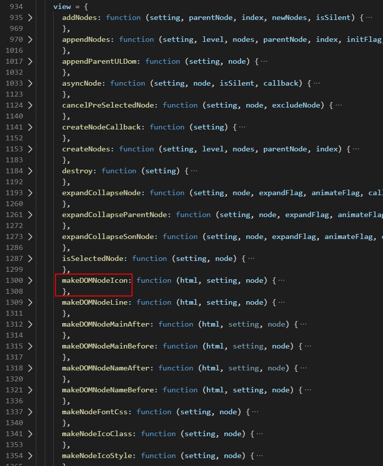

圈起来这个**makeDOMNodeIcon**，就是渲染icon和节点名称的那个方法。

### 4.4 makeDOMNodeIcon 渲染出节点icon和名称

```js
makeDOMNodeIcon: function (html, setting, node) {
    var nameStr = data.nodeName(setting, node),
      name = setting.view.nameIsHTML ? nameStr : nameStr.replace(/&/g, '&amp;').replace(/</g, '&lt;').replace(/>/g, '&gt;');
    html.push("<span id='", node.tId, consts.id.ICON,
      "' title='' treeNode", consts.id.ICON, " class='", view.makeNodeIcoClass(setting, node),
      "' style='", view.makeNodeIcoStyle(setting, node), "'></span><span id='", node.tId, consts.id.SPAN,
      "' class='", consts.className.NAME,
      "'>", name, "</span>");
  },
```
很简单，这个方法就做了一件事，往html里面push了两个span标签，一个是用于icon图标的，一个用于显示节点名称的。

我们需要的修改icon图标这个dom，仔细查看一下，icon这个dom的class和style分别通过**makeNodeIcoClass**和**makeNodeIcoStyle**去动态的获取。

这里我要介绍下，iconfont图标渲染形式——font-class引用：

```html
<i class="iconfont icon-xxx"></i>
```
所以我们只需要给这个节点的icon图标dom加上这两个类即可渲染出iconfont形式的图标。

往下翻看：

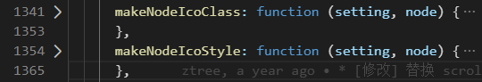


### 4.5 makeNodeIcoClass 给节点icon写上类名
先看**makeNodeIcoClass**：

```js
makeNodeIcoClass: function (setting, node) {
    var icoCss = ["ico"];
    if (!node.isAjaxing) {
      var isParent = data.nodeIsParent(setting, node);
      icoCss[0] = (node.iconSkin ? node.iconSkin + "_" : "") + icoCss[0];
      if (isParent) {
        icoCss.push(node.open ? consts.folder.OPEN : consts.folder.CLOSE);
      } else {
        icoCss.push(consts.folder.DOCU);
      }
    }
    return consts.className.BUTTON + " " + icoCss.join('_');
  },
```

这个方法就像名字那样，很直白，就是return一个字符串，即一些类名。

`consts.className.BUTTON`这个是常量，可以在`_consts`常量列表中找到值就是：

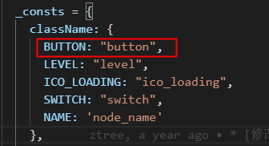

然后`icoCss`就是固定一个`ico` + `open close docu` 三选一拼接而成，如果设置了`iconSkin`属性那么就拼上这个。
也就是得到了两个类名吧：`button ico_open`这样形式的。

其实这些不重要，因为我们将完全彻底的改写这个方法。

改写如下：

```js
 makeNodeIcoClass: function (setting, node) {
    const iconName = data.nodeIcon(setting, node);
    return `${consts.className.BUTTON} iconfont ${iconName}`; 
 }
```
咱们通过data集合中的一个nodeIcon方法得到iconName，然后拼接成`button iconfont icon-xxx`形式。

保留`consts.className.BUTTON`是因为有样式，我懒得改。这样就可以渲染出iconfont的图标了。

看下**data.nodeIcon**（此方法放入data集合中）：

```js
nodeIcon: function (setting, node, newName) {
    const key = setting.data.key.nodeType;
    if (typeof newName !== 'undefined') {
      node[key] = newName;
    }
    return setting.data.iconMap[node[key]] || "";
  },
```
首先获得全局设置对象中的`setting.data.key.nodeType`这个属性，然后得到`node[key]=node.nodeType=0`，然后通过`key:value`形式返回`iconMap`的对应的那个值，最终得到此节点的icon图标类名。

节点例如：

```js
  { id: 1, pid: 0, name: "随意勾选 1", open: true, nodeType: 0, chkDisabled: true },
```


`setting`对象中的属性：

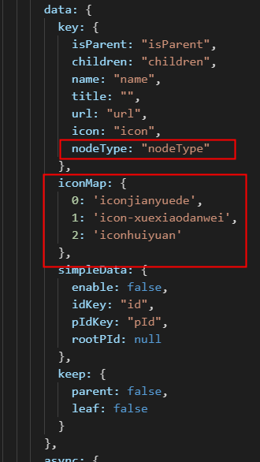

在这个例子中，获得的值就是`setting.data.iconMap[0] = 'iconjianyuede'`

最后还做了一个判断，如果`·node[key]`在`iconMap`中没有对应的`key`，也就是`setting.data.iconMap[node[key]] = undefined`，也有相应的返回值空串，这样做的好处是，有些节点不需要图标，那么在`iconMap`中就不要有相应的`key`，ztree就不会渲染图标。


### 4.6 makeNodeIcoStyle 给节点icon写上样式

控制图标显示与否`showIcon`相关的方法**makeNodeIcoStyle**：

```js
 makeNodeIcoStyle: function (setting, node) {
    var icoStyle = [];
    if (!node.isAjaxing) {
      var isParent = data.nodeIsParent(setting, node);
      var icon = (isParent && node.iconOpen && node.iconClose) ? (node.open ? node.iconOpen : node.iconClose) : node[setting.data.key.icon];
      if (icon) icoStyle.push("background:url(", icon, ") 0 0 no-repeat;");
      if (setting.view.showIcon == false || !tools.apply(setting.view.showIcon, [setting.treeId, node], true)) {
        icoStyle.push("width:0px;height:0px;");
      }
    }
    return icoStyle.join('');
  },
```
里面就是通过`isParent`和`showIcon`一起控制icon图标dom的样式，如果显示就是给background设置路径，不显示就让它宽高为0，最终返回一个包含样式的字符串。

我们的业务不需要判断父节点图标显示与否，所以不用管`isParent`属性，只要配合`showIcon`即可，改写如下：

```js
makeNodeIcoStyle: function (setting, node) {
    if(!node.isAjaxing) {
      if (setting.view.showIcon == false
          || !tools.apply(setting.view.showIcon, [setting.treeId, node], true)
          || data.nodeIcon(setting, node) === ''
        ) {
        const iconStyle = "display:none;"
        return iconStyle
      }else {
        return ''
      }
    }
  },
```
如果显示返回空串，不显示返回`display:none;`即可。

### 4.7 来看看效果

首先项目中引入iconfont：
```js
// main.js
import './style/iconfont.css'
```
然后引用咱们魔改后的ztree源码文件all：

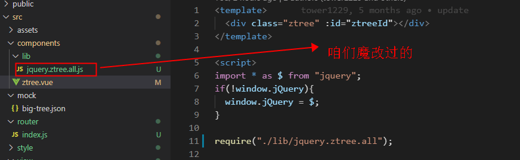

将它**require**进来，别忘了引入**jquery**!!!

```js
// 引入jquery
import * as $ from "jquery";
if(!window.jQuery){
  window.jQuery = $;
}
// 引入魔改版ztree
require("./lib/jquery.ztree.all");

// 调用ztree官方初始化方法，参数省略
$.fn.zTree.init()
```

最后效果就是这样：


效果不错，但是在你操作的时候，比如**折叠这个节点**会出现，此节点已有的图标会消失的问题。
所以，还需要继续看下源码接着修改。


### 4.8 折叠事件

在view集合中继续查看函数名，可以找到：

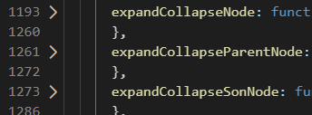

这三个方法，前缀都是expandCollapse意思就是展开节点这一类的意思。

展开**expandCollapseNode**方法，往下翻到1235行：

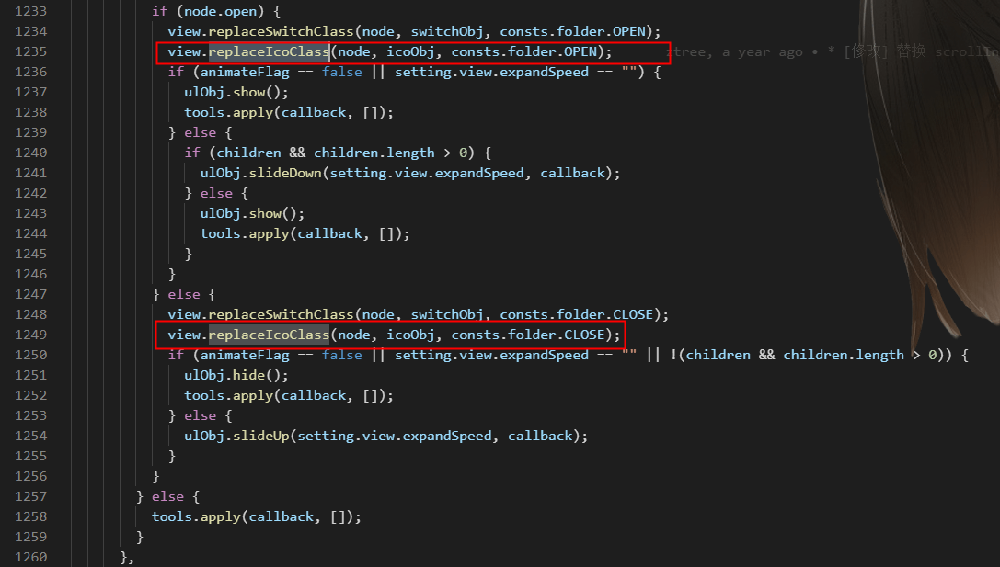

这里用一个`node.open`属性去判断调用**replaceIcoClass**方法，替换了icon图标dom的class。所以下一步，修改这个方法。

**replaceIcoClass**:

```js
replaceIcoClass: function (node, obj, newName) {
    if (!obj || node.isAjaxing) return;
    var tmpName = obj.attr("class");
    if (tmpName == undefined) return;
    var tmpList = tmpName.split("_");
    switch (newName) {
      case consts.folder.OPEN:
      case consts.folder.CLOSE:
      case consts.folder.DOCU:
        tmpList[tmpList.length - 1] = newName;
        break;
    }
    obj.attr("class", tmpList.join("_"));
  },
```

就是做了替换class的操作，不分析了，直接修改：

```js
replaceIcoClass: function (node, obj, newName) {
    // 根据你的情况，我这边就全部删除就可以了
 },
```
改完之后，折叠的时候节点图标不会消失，正常了。这样改完所有增删改功能都不会影响图标正常的显示了。

### 4.9 暂且完成一阶段任务

按照上面修改后，正常使用，可以满足业务的需求而且渲染海量数据上性能也十分出色。不过也只能说暂且完成一个阶段而已，毕竟狗需求天天改。。。


## 五、写在后面

> 我个人认为能看懂一些源码，且修改一些内容，并不厉害。毕竟会玩手机跟生产手机是一回事吗？

大家也不要妄自菲薄，其实很多源码并没有你想象的那些难，只是你认为自己不行，你的潜意识一直告诉自己：你看不懂。所以导致了大家误以为这些源码很难看懂。

> 其实我想告诉大家的是，多看源码，好处非常明显：

- 1.看看大厂或者大神人家的代码是如何编写的，人家的代码规范是怎么样的？
- 2.可以学到更多高阶函数的用法，大家面试的时候不是经常背一些什么函数柯里化，闭包，设计模式，compose等等，但是基本在自己的接触项目中不会用到，而这些好的开源项目中的源码内你就可以发现一些影子，你可以试着理解试着运用起来。
- 3.可以了解整个程序设计需要考虑的东西，这些开源项目的完整性和可维护性都非常的强，可以从中学习，并且提升自己。

GitHub链接：[**vue-magic-tree**](https://github.com/pengqiangsheng/vue-magic-tree) 希望能过帮到大家。
线上测试地址：[测试](http://tree.inner.ink/)