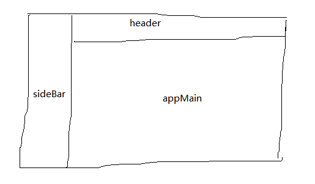
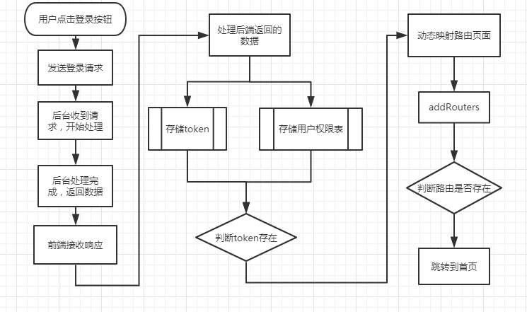
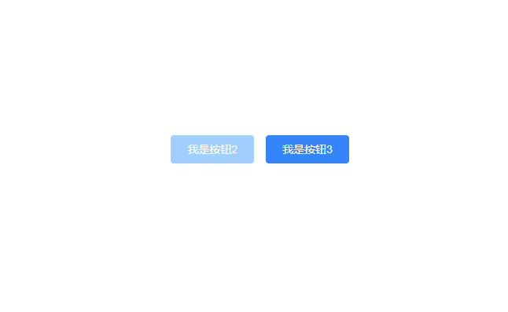

# 你不知道的前端·权限控制篇 之 中后台系统——故事化

## 一、前言
> 你不知道的前端之——中后台系统的权限控制，总的来说可以分为两大类，页面权限与按钮权限。

如果说**编程**的职业道路就像是在游戏中**打怪升级**的话，那么走这个分支练级的童鞋，首先要面对的第一只**劝退boss**就是——**权限控制**了。


1. 本文适合什么样的群众来阅读？

本文适合小白玩家，或者手残党，将要进军这分支（中后台），以及各路大神，操作党，**欧皇党**（坐在家里，咦，项目完成了！）等童鞋们食用哈，如果在食用的过程中，若感不适，敬请谅解。


2. 阅读完本文后你可以学到什么？

- 对于前端的权限控制会有更深的理解。
- 饭后闲时，故事看一看。

3. 这篇章怎么写的？

是我我那微不足道（6个月）的中后台系统的经验和理解，以及一些开源的中后台系统解决方案中借鉴然后消化完以自己的话描述出来的。

> 以下章节我将以轻松愉快且通俗易懂的例子相辅相成进行讲解。

## 二、概念介绍

> 玩一款游戏，是不是得先对游戏背景、设定、技能、人物等有所了解呀？

主要就这三个玩意：
- 1.中后台系统
- 2.权限控制
- 3.Vue-router

> 本文通篇以Vue为基础讲解。

### 2.1 中后台系统

As we konw, 中后台系统又称**中后台管理系统**，既然有**管理**两个字，那么**权限控制**就是必不可少的了。

> 让我们来看下它的一些特性

 - 中后台系统主要由大量的表单、表格、弹窗、按钮组成。（开发过的童鞋就知道啦）
 - 中后台系统主要给一些政府或非政府部门、单位、企业使用，也就是说它是to B端的。
 - 中后台系统页面主要布局为左侧sideBar（菜单页面），顶部header（面包屑，网站标题、logo、用户中心），中间AppMain组成（主要页面显示）。

> 鬼畜画风




> 目前来说，中后台系统的开发模式应该都是**传送**（前后端分离的模式）了，应该不会有**用腿跑图**（远古级别）的出现了。

### 2.2 权限控制

> 前面章节介绍了中后台系统的一些基础认识，接下来讲讲权限控制。

#### 2.2.1 权限控制分类
> 权限控制主要可以分为以下两大类：
- 1.页面权限
- 2.按钮权限

#### 2.2.2 什么是权限控制呢？

既然是管理系统，那么必然有不同的权限，举个例子：
你去图书馆借书的时候，你拥有借阅的权限，图书馆的工作人员拥有管理图书和出借的权限。

> 在这个案例中，按照游戏的模式去理解，你有**一个**技能，而图书馆的工作人员有**多个**技能，这就是权限的不同。

回归正题，在中后台系统中，**权限**的控制最明显是对**页面**的控制，也就是说在**左侧的sideBar**中，管理员它有**三十个**菜单页面可以点击，而普通用户只有**十个**菜单页面可以点击。

> 那么要怎么做到这一步，进行页面权限控制呢？

#### 2.2.3 小怪挡道关卡（从功能点做为切入点）

> 页面权限控制具体有哪些功能要实现呢？以上面章节举的例子来说：

- 1. 管理员有三十个页面（过路费30金币）
- 2. 普通用户只有十个页面（过路费10金币）

很清晰了是不是？我们只要实现以上两点，这不就o**k了。hh。

> O right，让我们接着来哈。

很简单嘛，让我们用两个钱袋子（变量）把这些金币分开存起来，如果是管理员小boss挡路了，我们拿出准备好的那个装有30金币的小袋子给它；来的若只是一只小兵，咱们给它10金币那个袋子就好了。

> 具体对应的页面和路由咱们先不讨论，就功能点做个判断。

咱们顺利解决了这第一道关卡，名曰：**小怪挡道**。接着往下探图哈。

#### 2.2.4 挖宝石关卡（按钮权限一览）
> 过了上面那关**小怪挡道**后，是不是觉得自己的大宝剑饥渴难耐了，忍不住拿出擦亮些。

先别急哈，咱们要致富先挖路。呸!! 不对哈，先挖宝石呀。

假设你进入了一个藏有**很多宝**石的房间，里面各个角落埋藏着许多**价值连城**的宝石，拥有一颗你就可以**富可敌国**了。是不是按捺不住激动的心、颤抖的手！！！（房间很大，光线不足）

这个时候，房间的机关突然被你**触发**了，一阵机关齿轮的声响过后，你还以为自己应该是挂了，没成想在墙面上挂着的**破二锅头瓶子**中突然冒出**一缕青烟**，没等你有所动作，青烟幻化成一**糟老头**，露出它那少了一个门牙的大嘴巴子**怪笑**着对你说道：‘小子，你是谁？’。正当你要回答时，‘...，我想起来了，来到这里的人，都是贪婪的人，都想要挖走宝石，小子就且看你运气如何了，运气好的能带走一些，不好的，嘿嘿...都留下来陪我吧！’那糟老头子歪着漏风的嘴对你嘲讽后就消失了...

你开始迷惑起来，但**欲望**使你**肾上腺素上升**，你心跳加速，因为前面不远处就有一块很大且泛着蓝色光茫的宝石。你蹲下来，准备拿起，两手一抓，但是宝石就是拿不起来，无论你使出多大的劲。过了不一会，你满脸通红，汗流直下，**精疲力尽**，气喘吁吁，一屁股做倒在地上，‘呼呼...’的喘着大气。突然，一阵笑声传来，‘哈哈哈，**笨蛋，笨蛋...**’ 你被这笑声弄的十分**愤怒**，不知是哪里来的力气，**伸手往后一抓**，不知拿了一个什么东西，就往那笑声处一砸！‘碰！’那笑声戛然而止，你仰头倒在地上，大口大口的**喘着气**，休息了很久，起身往刚才那笑声处走去，待你走前一看，地上空空如也，只有一颗**绿色**的宝石流淌着那**说不清道不明**的颜色的光，如鸽子蛋大小横躺在地上。你捡起后，突然明白了什么：
- 1.刚才随手一抓的东西是宝石（幸好没丢）
- 2.为什么蓝色的那块宝石拿不起来？（好气）
- 3.为什么这个能够拿起的宝石，它的颜色...（嗯*****）

> 开始解析哈，蓝色宝石能够看见却拿不来，其实对应的是一个按钮可以看见，却不能点击（禁用状态）。蜜汁绿色宝石，对应的是另一个按钮，你可以看见且能够点击（触发事件）。至于它的颜色嘛，嗯...无法解释，只有一句话：要想生活过得去，头上必须带点绿。

在你捡起这块宝石**不久后**，又是一顿‘机关齿轮转动的声响’过后，在你的正前面，出现了一束光，**顺着光前去**，你发现原来是一道门。正在你**犹豫**要不要走过去的时候，你的身子**突然**被什么东西撞了一下，你跌倒在门外，还没等你重新站起来，门‘碰’的一声关上了！你站起身来，转头向门上看去，这扇门是那种有年份的木门，门上贴了一张纸：
- 上批：欲望之门。
- 内容：这道门后关着**人们的欲望**，那些五彩斑斓的宝石，就是每个人目前的欲望。能够被你拿起的宝石是通过**你的努力**能够获得的；拿不起的便是你**没有能力**却心生贪婪和欲望想要得到的东西；而最令人恐怖的是那一望无边的黑暗，那是你**无止尽**的欲望所生成的**最黑暗最深不见底**的**大恐怖**。

> 解析这张纸的内容，共分为三个观点，分别对应：
- 1.有点击权限的按钮（能看见按钮且可以触发事件）；
- 2.无点击权限的按钮（页面渲染此按钮，但你不可以触发事件）；
- 3.深不见底的大恐怖（你没有查看和点击权限的按钮）

> 故事好像讲多了，哈哈，后面在专门出个完整故事版的专栏。

### 2.3 页面权限

> 从现在开始，讲解代码啦！

#### 2.3.1 从前端路由说起

> 首先你得对路由有所认知——vue-router。

重点掌握：

- 全局前置守卫
- router.addRoutes

全局前置守卫
```js
你可以使用 router.beforeEach 注册一个全局前置守卫
const router = new VueRouter({ ... })

router.beforeEach((to, from, next) => {
  // ...
})
```

使用全局前置守卫去作为一个**拦截器**这样的角色，拦截每一次的路由跳转变化，在去下一个路由之前，判断用户是否已登录，`token`是否存在。反之，自动跳转到登录页面。

addRouters
```js
// 函数签名
router.addRoutes(routes: Array<RouteConfig>)
// 动态添加更多的路由规则。参数必须是一个符合 routes 选项要求的数组。
```

> 更多vue-routerd的内容请自行前往官网查阅。

完整登录流程图



`addRouters`可以在整个程序（中后台系统）运行期间，动态的添加更多的路由页面（只要参数符合规范）。意味着，可以在用户登录期间，发送登录请求给后台时，后台验证账号密码等信息正确，然后生成`token`，生成该用户的权限表，一起带回给前端。然后前端接收到响应之后，储存`token`, 用户权限表等信息到session Storage和store（Vuex）中。接着将获取到的后端用户权限表中的页面权限与前端的路由组件映射到一起，从而生成动态可访问的页面，然后通过`addRouters`作用到整个程序的生命周期当中，最后跳转到用户可访问页面。一个完整的登录流程便结束了它年轻的生命，贡献了许多默默无闻。

上面这一步便是完成了管理员身份拥有三十个页面，而普通用户身份只有十个页面的功能点。

#### 2.3.2 谈一谈登录流程（几个颇为重要，容易坑的点）

1.在全局前置守卫中添加路由白名单。
```js
// 在白名单中的路由放行
const whiteList = ['/login']
```
> 不然你连登录页面都进不去。

2.在全局前置守卫中的逻辑要合理，不然容易出现死循环。（说多是都是泪水和坑。）

3.后端用户权限表中的页面权限与前端的路由组件映射这一步怎么操作？
> 在你成功登录后，拿到了后端生成的用户权限表数据后，你满心欢喜，却不知你依旧稚嫩。

前端的路由组件集合，我一般放在router文件中的index.js，然后导出使用：
```js
export const routerMap = {
  layout: () => import('@/views/layout/Layout'),
  dashboard: () => import('@/views/dashboard/index'),
  center: () => import('@/views/center/index'),
  ...省略更多
}
```

我拿到的后端用户页面权限表是下面这个样子的对象：
```js
{
    path: '/dashboard',
    name: 'dashboard',
    component: 'dashboard', // 替换着一项内容
    id: 11,
    meta: {
        title: '首页',
        icon: 'iconfont iconHome'
    }
}
```
主要就是替换掉component这个属性，方法如下：
```js
// 映射，需要递归判断二级菜单、三级菜单
function generateAsyncRouter(routerMap, serverRouterMap) {
  const { length = 0 } = serverRouterMap
  for(let i = 0; i < length; i++) {
    const curRouter = serverRouterMap[i]
    curRouter.component = routerMap[curRouter.component]
    const { children = [] } = curRouter
    const { length:len } = children
    if (children && len) {
      generateAsyncRouter(routerMap, children)
    }
  }
  return serverRouterMap
}
```
具体使用：
```js
 import routerMap from '@/router'
 // 省略中间逻辑
 // serverRouterMap是后端返回的具体某个用户的页面权限表
 const asyncRouterMap = generateAsyncRouter(routerMap, serverRouterMap)
 router.addRoutes(asyncRouterMap) // 动态添加可访问路由表
 router.push({ ...to, replace: true }) // hack方法 确保addRoutes已完成
```

> 做完这些步骤，动态可访问路由页面的功能点其实就完成了，当然还有在全局前置守卫中的判断逻辑，这我就不上代码了，主要根据你的业务需要，先判断`token`，再判断页面权限表，然后放行。如果没有这些就跳转到登录页面。大致的步骤是这样的。

### 2.4 按钮权限

> 做完了页面路由权限控制其实已经完成了一大半了，但是我们公司需要对权限的控制更加变态，精确到每一个按钮的显示与否、禁用与否。

其实只要在按钮上加个if判断不就完事了，但是太麻烦，需要写太多重复的if判断逻辑代码，可读性很差，维护起来也十分恶心。

于是乎有了以下的解决方案：

- 1. 封装一个v-auth指令作用在元素上。
- 2. 结合此指令进一步封装按钮元素。

#### 2.4.1 v-auth 按钮权限
> 通过vue的自定义指令功能，封装一个按钮权限判断指令。

这个是vue-element-admin（中后台前端解决方案）开源的一个封装文件：
```js
import store from '@/store'

export default {
  inserted(el, binding, vnode) {
    const { value } = binding // 取出指令的值，指的是v-auth="['admin']"中的'admin'这个值
    const roles = store.getters && store.getters.roles // 从store中取出储存好的后端给的权限表

    if (value && value instanceof Array && value.length > 0) { // 判断value是否有值，类型是否正确
      const permissionRoles = value
      // 只要当前权限名称在权限表roles中有一个匹配项就返回true
      const hasPermission = roles.some(role => {
        return permissionRoles.includes(role)
      })

      if (!hasPermission) {
        // 如果没有权限就移除这个按钮元素
        el.parentNode && el.parentNode.removeChild(el)
      }
    } else {
      // 类型错误，抛出异常
      throw new Error(`need roles! Like v-permission="['admin','editor']"`)
    }
  }
}
```
以上代码我都逐行注释了，阅读起来应该很简单。功能就是实现了按钮的显示与否，具体的判断是否有这个权限的逻辑，你可以根据你的业务需要去改就好了。

> 但是，以上代码，并不能满足我按钮禁用与否，所以我依旧需要进一步改进。

#### 2.4.2 改进后的指令

```js
// 指令部分
inserted(el) {
    // 这部分要处理获取当前页面当前用户的所有按钮权限表，这个根据实际业务去获取
    // 假设我获取了当前页面当前用户按钮禁用权限表
    const pageBtnPermisson = {
      btn1: 0, // 隐藏按钮
      btn2: 1, // 显示但禁用
      btn3: 2 // 显示不禁用
    }

    // 设置样式，偷懒直接使用了element-ui写好的button的class
    const BTNPRIMARYSTYLE = 'el-button--primary'
    const BTNMEDIUMSTYLE = 'el-button--medium'
    const BTNBASISSTYLE = 'el-button'
    const BTNDISSTYLE = 'is-disabled'

    // 公用样式设置
    el.className = `${BTNBASISSTYLE} ${BTNMEDIUMSTYLE} ${BTNPRIMARYSTYLE}`
    // 判断禁用、显示
    const { dataset = {}} = el
    const { name = '' } = dataset
    if (dataset && name) {
      switch (pageBtnPermisson[name]) {
        case 0:
          el.parentNode && el.parentNode.removeChild(el)
          break
        case 1:
          el.className += ` ${BTNDISSTYLE}`
          el.disabled = true
          break
        case 2: break
      }
    }
  }
```
```html
// 页面部分
<el-row style="margin-top: 33vh;text-align:center;">
  <button v-auth data-name="btn1" @click="handleClick">我是按钮1</button>
  <button v-auth data-name="btn2" @click="handleClick">我是按钮2</button>
  <button v-auth data-name="btn3" @click="handleClick">我是按钮3</button>
</el-row>
```
实际效果如下：


跟我们预想的一样，第一个按钮被移除，第二个显示但是禁用，第三个显示且可用。实测点击`我是按钮2`并不会触发`handleClick`事件，只有点击`我是按钮3`才会触发。查看dom元素，并没有`我是按钮1`的元素存在。所以达到了我们的需求。

#### 2.4.3 原理分析

- 1.通过原生button组件的原生属性`disabled`做禁用功能（配合样式）。
- 2.通过v-auth指令去帮我们做一些重复的事情。
- 3.至于获取当前用户当前页面的所有按钮权限表的逻辑这部分代码，需要你跟后端、产品一起敲定整个**页面+按钮**权限表如何设计。


## 三、后话

> 本文就前端——权限控制为主题，展开分析整个中后台管理系统的概念组成原理，包括登录流程，权限类型划分，还是干货满满的，自我感觉良好。

每个项目的需求都不一样，但是万变不离其宗，咱们把它破开来，裸着看，就清清楚楚了，我在这里只是提供了一些思路，仅供参考和阅读，吃瓜群众路过点个小心心哈，2019年最后一天感激不尽啊！

如何你有了更好的权限控制的方案，不妨留言啊，我们一起讨论，一起进步，一起成长！

最后附上本人联系方式：

- 1.留言哈
- 2.留言哈
- 3.留言你就知道了
- 4.重要的事情说多遍，留言+点赞

开玩笑啦，本人wechat：

