# 一个JS初级工程师的闭包自我理解---闭包虽老，我亦犹新！


## 1.什么是闭包？

面试官问：瓦特is闭包？

A童鞋：I node，闭包is 几拉呱啦，巴拉巴拉...

**MDN**：函数与对其状态即**词法环境**（**lexical environment**）的引用共同构成**闭包**（**closure**）。也就是说，闭包可以让你从内部函数访问外部函数作用域。在JavaScript，函数在每次创建时生成闭包。

直观表现：
```js
function father() {
    var name = "Dede"; // name 是一个被 father 创建的局部变量
    function child() { // child() 是内部函数,一个闭包
        console.log('My father name is ' + name); // 使用了父函数中声明的变量
    }
    child();
}
father();
// 输出
// My father name is Dede
```

## 2.闭包的作用？
巴拉巴拉巴拉....相信大家都耳熟能祥

主要用处：

- 1.让外部访问函数内部变量成为可能；

- 2.局部变量会常驻在内存中；（**节流、防抖**等高阶函数实现）（优点亦是缺点）

- 3.可以避免使用全局变量，防止全局变量污染；


## 3.闭包的优缺点？

巴拉巴拉巴拉.....相信你也可以说出来

- 会造成内存泄漏（有一块内存空间被长期占用，而不被释放）

## 4.分析

很多人在面试的时候都会可以或多或少回答出这些基本概念，可是其中又有多少人只是在背答案而**没有真正理解**清楚其概念？

更别提如何去**灵活运用**了。

- 许多**高阶函数**中都涉及到了闭包的运用，例如：**节流、防抖、promise**等高阶函数；
- 另外一些**插件，框架**中也运用到了闭包。

## 5.结论

> 闭包可以说在js这门语言学习生涯中第一个分水岭。----来自‘伟’大的小呆

真正掌握闭包的工程师，才算是开始有突破的趋势了。

闭包中包涵的概念有多少，来捋一捋？

- 1.最基本函数的运用

- 2.变量的作用域

- 3.内存的分配，指针指向

- 4.垃圾回收机制

作用域就可以延伸到this的指向等等...

内存的分配完后，垃圾回收机制紧随其后...

> 等等，你以为真的结束了吗，其实才刚刚开始！

## 6.一道经典的面试题

### 6.1 第一题


> 你能正确搞清楚，每一步都发生了什么，最后的结果是什么吗？

这题考察的就是在JS中**内存的分配**，和**变量引用**(指针)的问题。

> 我习惯用指针来描述这个引用的概念，可能不是很正确，但很好理解。


### 6.2 第二题
好的，这题有点难，我们先来一个小demo练手:

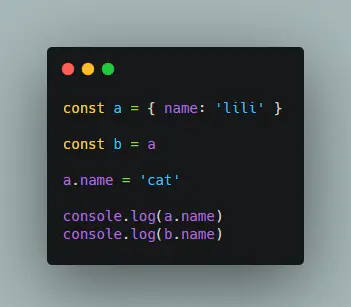

这题，稍微懂点JS引用类型的童鞋，应该都知道：

- 1.a实际上不是{name: lili}这个对象，只是该对象的地址引用。
- 2.b=a，也就是指向了{name: lili}这个对象。
- 3.a指向的对象的name属性重新赋值为cat，现在该对象为{name: cat}
- 4.打印a.name，会先找到a指向的那个内存空间，然后把数据取出来，最后输出cat。
- 5.打印b.name，因为b也指向了该对象，所以输出的是cat。

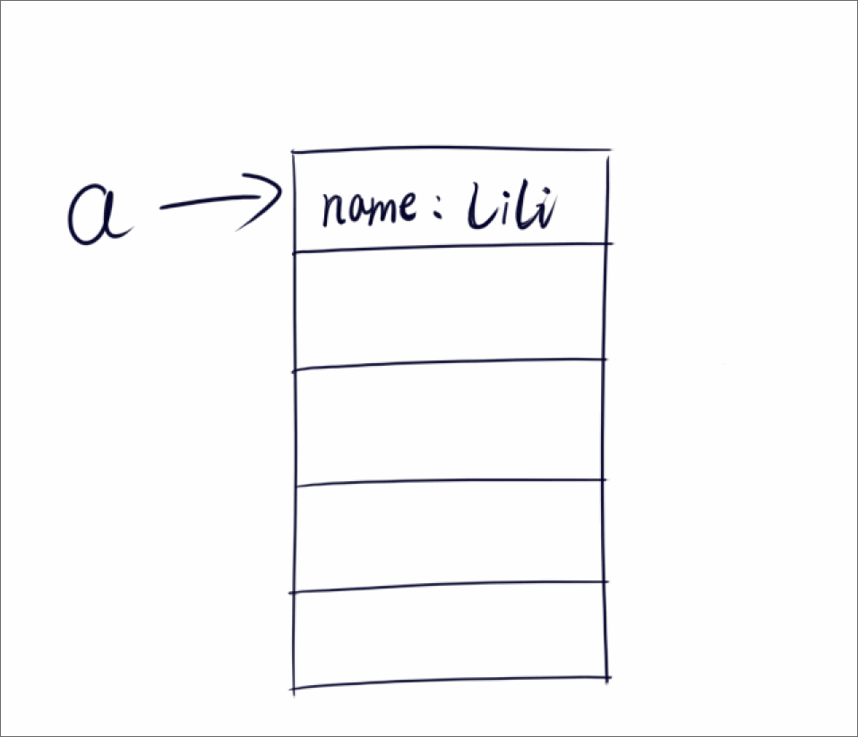
> 你可以测试 a===b a是全等于b的，因为它们都是引用类型，只是一个指针，所引用的地址是一样的。

这题没有难度其实，稍微理解下引用类型的概念就可以掌握了。


### 6.3 解决第一题
> 回到这题

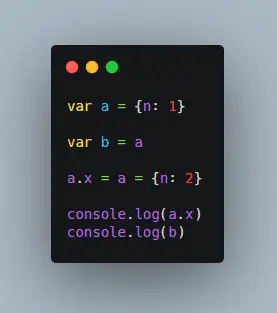

找这题就比较复杂了，我们要一步一步来解答：

- 1.首先js会在内存中分配一块空间用于存放{n: 1}这个数据（这里叫**明明**），然后把该空间的地址引用赋值给a。
- 2.变量b也指向这个对象{n: 1}**明明**。
- 3.a.x=a={n: 2}，这一步操作好像争议颇多，我也不是很清楚。
- 4.我认为有一种解答还是比较有说服力，就是说不管是a.x=a={n: 2}，还是a=a.x={n: 2}，赋值的顺序是有优先级的，就像运算操作符乘除优先级大于加减这样的概念。这里，对象属性访问操作的优先级要选大于访问对象。
- 5.所有就是a.x会先做赋值运算，得到一个结果，a.x={n: 2}，也就是a（或者b）指向的那个对象（**明明**）会多一个属性x={n: 2}。
- 6.接着继续赋值，变量a会**重新指向**一个**新的地址**，该地址空间存放着{n: 2}这么一个对象（叫**二狗子**）。
- 7.到了这里就清楚了，最后a是一个新的地址的引用，该地址存放的**二狗子对象**是{n: 2}，那么通过a.x访问该对象的属性x，但该对象只有一个属性为n，那么将打印出undefined。
```js
a = {
    n: 2
}
a.x  === undefined
```
- 8.而b指针指向的**对象明明**里面的数据结构是：
```js
b = {
    n: 1,
    x: {
        n: 2
    }
}
```

- 9.并且可以尝试b.x === a，将会输出true。

> 我个人认为，这是最好理解的一种思路，同时我也在不断学习中，如果有大佬指出概念不对的地方，我会虚心接受。

### 6.4 再来一题验证思路

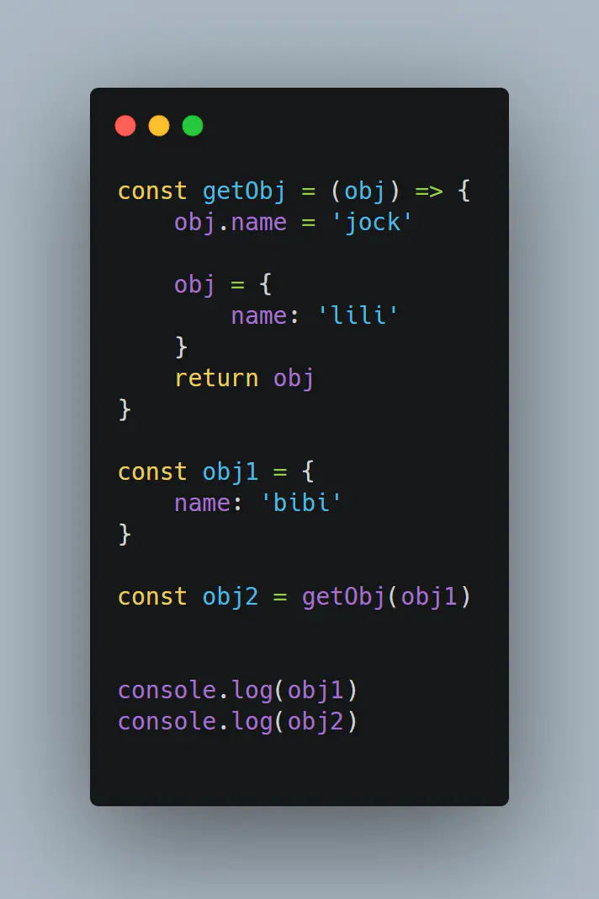

- 1.首先分配一块空间给对象{name: bibi}，然后将该对象的地址引用赋值给obj1。
- 2.通过getObj函数得到一个对象赋值给obj2。
- 3.传入函数的参数是obj1，也就是传入了一个指针，然后在函数内部，将该指针指向的对象的name属性修改为jock。
- 4.重新分配一块空间给对象{name: lili}，将该对象的地址引用赋值给形参obj，最后return 该指针obj。
- 5.变量obj2将得到一个值为对象{name: lili}的地址引用，也就是新对象的指针。

> 最后打印obj1，将输出的是name=jcok。打印obj2，将输出的是name=lili。
并且使用 obj1 === obj2 将得到false的结果。

> 好了，这部分就是内存分配，指针地址引用的部分，不再深入。

### 6.4 垃圾回收机制

> 那么阅读到这里，你应该对引用类型的概念更清楚一些了，脑海里有了指针的概念后，就容易多了。

讲到内存的分配，自然有内存的释放。而垃圾回收机制就是内存释放的一个过程。JS中是自动回收那些分配的空间，它有一些相应的策略。

最简单的来说，就是分配了一个内存空间，该空间使用后若无地址引用，也就是没有任何一个从根开始的指针指向该地址空间，那么JS就会派部队去清除该地址空间的数据，然后释放这块空间占用的内存。

这里指出，应该是没有一个从根节点开始访问的那个值，才会被删除。有可能一个对象它有一个或者多个指针指向它，但是没有从根开始的引用或者是指向，这个对象也将被回收。专业名词叫做：**可达性**，也就是可以被访问到的意思。

JS的垃圾回收机制一般可分为标记清除和引用计数这两大块，具体不细讲。

### 6.5 总算明白了a = null，并不是将原先a指向的对象给删除掉

很多时候，总认为我给a赋值一个null，那么就意味着我把原先a指向的对象中的数据给删除了，其实并没有。你只是让该对象失去了地址引用，并不是你在删除它，是JS会去监视那些**不可达**的值，然后通过垃圾回收机制去删除它的。

也就是说，你a=null后，之前的对象并没有马上被删除，应该是J会在一个合适的时机去做这件事。而且，a=null并不意味着该对象就真的失去了地址引用，有可能你在别的地方还用其他变量保留了该对象的地址引用，那么你想要的效果将会不奏效。

## 7.再讲闭包，重新认识

> 说了那么多好像跟闭包无关的概念，但是恰恰是这些概念，才能使你充分理解闭包的精髓，并且能够去运用闭包解决一些实际问题。

### 7.1 变量常驻内存

根据MDN提供的术语，在js中，闭包生成的时机是函数创建的时候。但是我还是不太懂这什么意思啊，所有我只能去看看别人的理解，然后找到一句我认为我可以理解的话：

闭包就是可以创建一个独立的环境，每个闭包里面的环境都是独立的，互不干扰。闭包会发生内存泄漏，每次外部函数执行的时候，外部函数的引用地址不同，都会重新创建一个新的地址。但凡是当前活动对象中有被内部子集引用的数据，那么这个时候，这个数据不删除，保留一根指针给内部活动对象。

[原文出处链接](https://blog.csdn.net/weixin_43586120/article/details/89456183)

> 我彭大师从不抄袭，也不会打妄语。

这句话告诉我们，在内部函数引用了外部函数的数据时，这个数据不会被删除，会保留一个指针引用给内部对象，从而这个数据的内存空间就不会被回收机制干掉，也就有了闭包会让变量常驻内存这个特点。

### 7.2 高阶函数:节流、防抖的实现。

> 从而我们来分析一个我们经常被问到的两个函数：节流于防抖。

这两个函数是会一起被提及的，它们的概念呢也经常会被混淆，有时候傻傻分不清节流和防抖的区别，以及它们使用的场景。
- 场景1：只是在脑子里有一个概念，我要优化一些操作的时候，就会想起节流和防抖，但是具体用哪一个，我并不是很清楚，需要再百度一下，然后再选择一个用。
- 场景2：面试的时候，面试官总爱让你手写节流、防抖这两个高阶函数。你在面试前总是背的半死，到了笔试的时候，总是会想不起来怎么写，或者总是会写错一些步骤。

所以，本节我们就一起彻底的弄清楚节流和防抖的概念，以及在真实代码中的运用和如何自己手写一个这样的函数。

我们不从什么是节流和防抖这两个概念入手，这样还是生搬概念，无法让人简单去理解。

我们从实际的运用中去把这两个概念提取出来，这样就成为你自己的东西了。

### 7.3 搜索框优化

第一轮：

某一天，你开发了一个搜索框的功能，这个功能用于关键词检索。

你仔细检查，自测无误后，提交代码，满心欢喜让测试开始测试，自认为天衣无缝，没有任何bug。

不久测试小姐姐说，你这个页面有bug啊。

？？？


你心想，怎么可能，我明明自己测了很多次，根本没有任何问题，你说说看，哪里会有问题？？

测试小姐姐：你这个输入框，我才输入了一个字，我还没输入完，这页面怎么就开始有搜索结果了呢？？

First Blood!!


嗯？？一定是小姐姐打字太慢了，我去看看怎么回事。

你一看代码，原来你用的是input，change事件，当input绑定的value的值发生变化的时候，就会触发此事件，然后去调用搜索接口。

但是好像，不需要一有值就马上去搜索，这样第一个问题就是，用户没有输入完，就去查询结果。第二个问题，就是一直频繁的请求接口，造成了没必要的请求，造成了性能的损耗。

然后，作为一个合格的程序员，你会去思考，该怎么去优化这个搜索功能。按照常规的思路走，要不我在输入框旁边加个按钮，点击才搜索，这样就不会有没输入完就开始搜索的问题了，也不会一直频繁的请求接口了。

第二轮：

于是你，开始了新的一轮修水管的任务了。噼里啪啦，半小时后，你又满心欢喜的提交了代码，然后到了小姐姐手上。

没过多久，小姐姐就跟你说，又有问题，你这个交互逻辑很繁琐啊，用户输入完，还要去点击那个丑丑的按钮，很不便捷。其二，我压力测试，我可以一直去点那个按钮，这样一直在发送http请求，造成了网络拥堵，要是有人故意这样搞破破坏，一直请求后台，会对服务器的性能和带宽带来严重的影响。

此刻，你的内心是崩溃的，我明明优化了，怎么好像问题更多了。

Double kill!!!

经过一段自我怀疑自我调整的过程，你又有了新的优化方案，我去限制你用户请求接口的频率不就好了吗，我让你延迟一会，才会去触发调用接口，岂不妙哉！

第三轮：

你开始在调用接口的地方，写了一个setTimeout函数，延时1秒去调用接口。你测了几遍感觉没什么问题，小心翼翼的检查几次后，提交代码到测试小姐姐手上。

经过小姐姐一番揉虐，小姐姐说：你这个还是不行啊，虽然第一次是延迟了1秒请求，但是我点了100次，但是过1秒后，马上就有100个请求出现了。

Triple kill!!!


第四轮：

你思考的方向是对的，但是还是没有起到作用。首先确定，使用延时这个方法是可行的，但是怎么限制在一段时间内，只能有一次的请求。比如设置一个时间为2秒钟，在这个期间，可能会触发10次的chang事件，那么怎么把10次事件只触发一次呢？

> 思考点：10次请求如何只触发一次？

思路，从定时器本身下手。什么是定时器？

```js
setTimeout(() => {
    console.log('屏幕前的你，若是男生，则帅；女生，则肤白貌美！')
}, 1000)
```
上述代码运行后，过1秒钟左右是不是会输出：

`屏幕前的你，若是男生，则帅；女生，则肤白貌美！`

这句话。

如果我们将其用一个函数包裹起来：

```js
function sayToYou() {
    setTimeout(() => {
        console.log('屏幕前的你，若是男生，则帅；女生，则肤白貌美！')
    }, 1000)
}
sayToYou()
```
是不是结果跟上面的一样。

那如果我点击了十次按钮，就会触发十次sayToYou函数，只不过是延时1秒后，马上发输出10句。

那么我想要的是连续快速的点击十次后，只有一次的sayToYou函数中的定时器的回调能够被触发，那该怎么办呢？？

是不是可以用一个变量将定时器先存储起来，如果在一段时间内（**第一个**定时器定时的时间范围内）又有新的函数被触发了，那么先判断这个变量是不是存在了，如果存在上一个（第一个）定时器变量，那么我就将上一个（第一个）定时器清除掉，不让它触发回调任务。这样之前的点击事件是不是就无效了。只有当前的点击事件继续进入定时器内，等待这段时间过去，才会触发回调事件。

那么我们就这样做吧，改造一下我们的sayToYou函数：
```js
let timer = null
function sayToYou() {
    if(timer) {
        clearTimeout(timer)
    }
    timer = setTimeout(() => {
        console.log('屏幕前的你，若是男生，则帅；女生，则肤白貌美！')
        clearTimeout(timer)
    }, 1000)
}
// 用循环 模拟高频点击按钮100次
for(let i = 0; i < 100; i++) {
    sayToYou()
}
// 过一秒钟左右，只输出一次。
```
运行次代码，你即将热泪盈眶，因为和你设想的结果一毛一样。

> 首先我们屏蔽清除定时器的那行，将得到100句的输出：

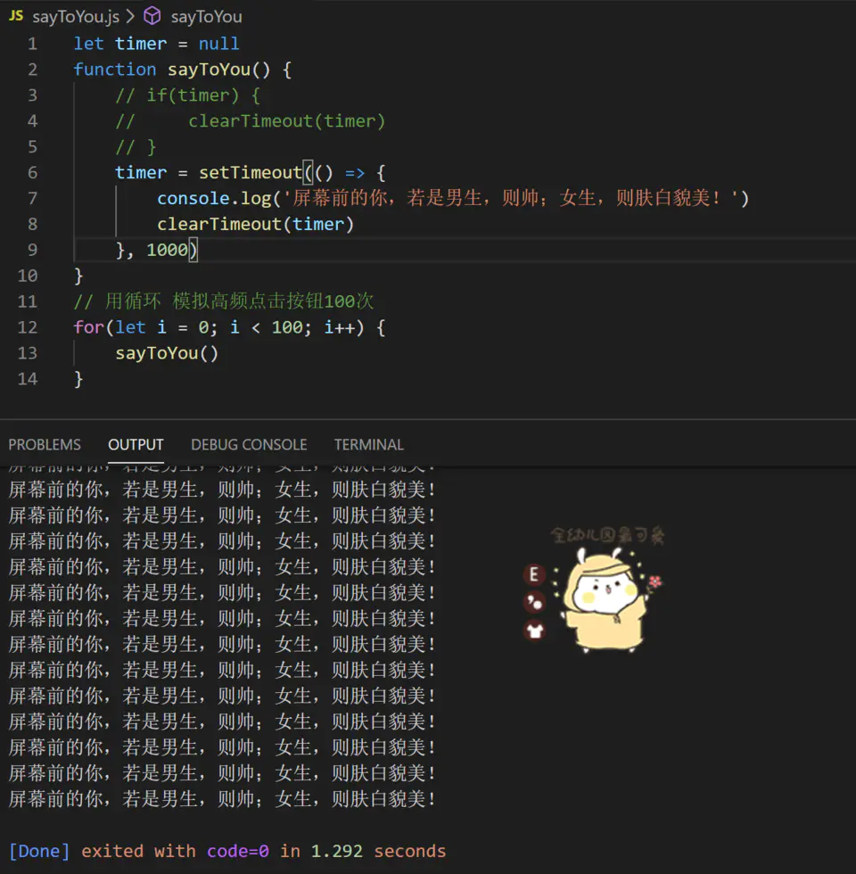

> 接着不屏蔽那句清除判断:

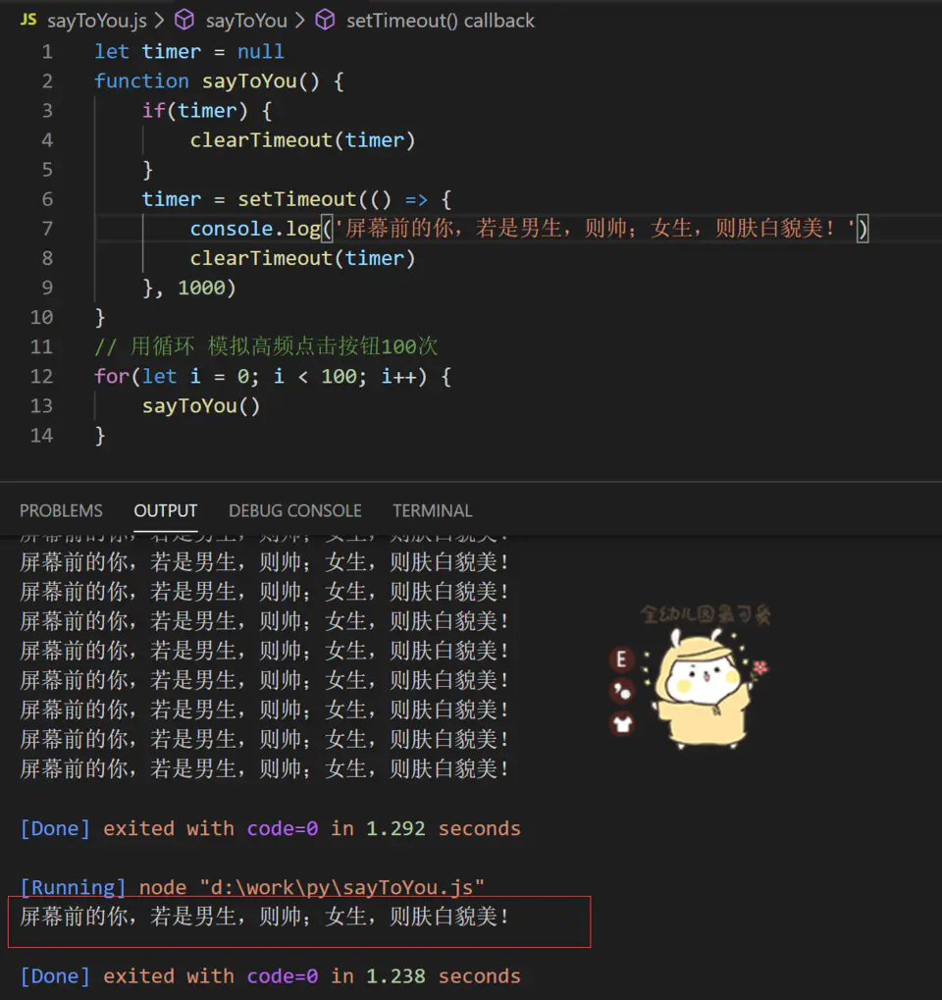

是不是和我们预期一样 只会输出一句！！！

> 那么我们接着优化一下我们的代码

现在虽然是可以在高频触发的情况下，只会触发一次回调，但是我们还要额外去声明一个变量，那如果我有很多地方都需要调用这个函数怎么办？？

难道要去多个地方都定义一个变量这样，岂不是很麻烦？？

那么，说了这么多，引入了这么多js概念，终于到了重头戏了，我们在前面讨论闭包的时候，是不是有说到闭包的优点，咱们是不是可以利用起来。

> 现在想想闭包有什么优点（特点）？

回答：使变量常驻内存中

ok，那么我们将闭包的特性引入进来，改造一下：

- 1.首先，咱们要创建一个闭包
- 2.内部函数使用外部函数中的变量
- 3.返回这个函数

改造后的代码：
```js

function debounce() {
    let timer = null
    
    function sayToYou() {
        if(timer) {
            clearTimeout(timer)
        }
        timer = setTimeout(() => {
            console.log('屏幕前的你，若是男生，则帅；女生，则肤白貌美！')
            clearTimeout(timer)
        }, 1000)
    }
    return sayToYou
}

// 使用一个变量得到防抖的返回函数
const sayToYou = debounce()

// 用循环 模拟高频点击按钮100次
for(let i = 0; i < 100; i++) {
    // 执行此函数
    sayToYou()
}
```
> 分析：仔细看，我们的sayToYou函数是不是里面逻辑一行代码都没有改动，我们改动的是什么？

- 1.另起一个叫做debounce的函数，里面定义了一个timer变量。
- 2.一个内部函数sayToYou，也就是我们之前那个sayToYou函数。（无更改）
- 3.最后return此函数。
- 4.引用的方式变化，外部调用的sayToYou函数是通过调用debounce函数获得的返回值。

上面debounce咱们给它称为父神，那么里面的sayToYou咱们给它叫做造娃，由于父神的记忆不是很好（老年痴呆？），父神需要在手臂上（timer）划一道痕来标记那个娃。造娃的过程很简单，父神抓一把泥巴开始捏娃，然后在手臂上划一下。（造娃需要1秒钟），造完后，父神手一挥，手臂上的痕迹就不见了。

```js
//当父神执行的时候，也就是父神开始造娃的时候了，失手将催娃口诀遗失在人间
const sayToYou 催娃口诀 = debounce()

// 这个时候有一些愚蠢的凡人，一直在向上天祈祷（催娃）
// 要让催娃口诀生效，必须加两个神秘的符号（）
for(let i = 0; i < 100; i++) {
    //催娃
    催娃口诀()
    sayToYou()
}
// 虽然这个时候被催娃了100遍，但是父神一看手上的痕迹还在啊，你催个蛋蛋娃，给本神等着。
// 最后，娃造完后，父神大手一挥，手臂的痕迹不见了，娃就落地了，呱呱大叫：你个大丑逼！
```

运行结果

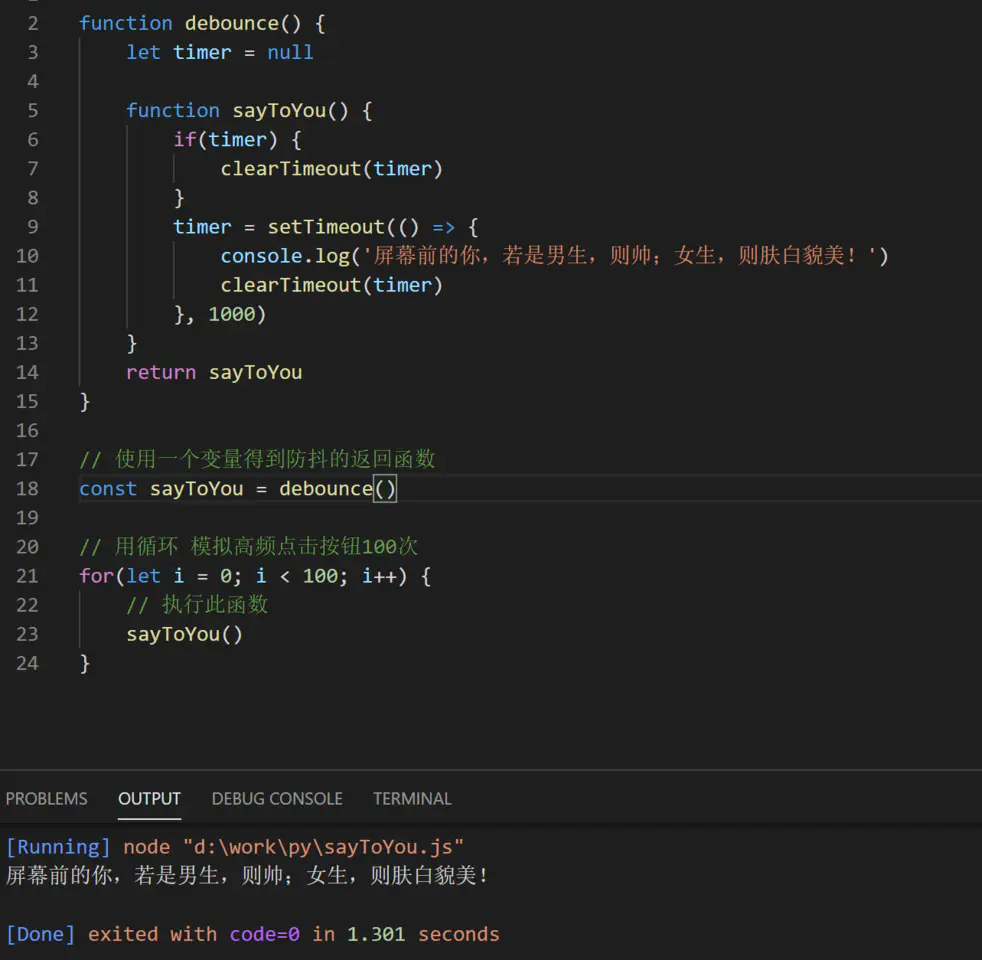

这就是结合闭包的用法，优化了我们的函数。

### 7.4 彻底要理解闭包

其实大家可能还是不能体会到下面这句话的意思。

> “每次外部函数执行的时候，外部函数的引用地址不同，都会重新创建一个新的地址。但凡是当前活动对象中有被内部子集引用的数据，那么这个时候，这个数据不删除，保留一根指针给内部活动对象。”

这句话太长，我们要分成两句话：

- 1.父函数每执行一次，都会创建一个新的引用地址。
- 2.会保留一根数据指针给内部函数使用。

结合到一起，意思就是，同一个引用地址的内部函数所引用的那个变量是同一根指针。

为了更直观显示出区别，我们要改下代码：

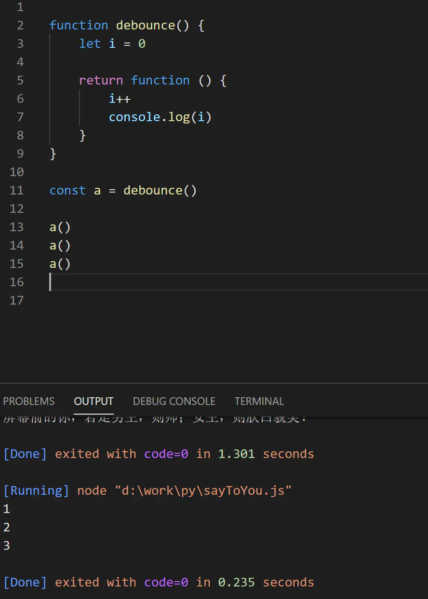

执行过程：a的到了父函数执行的一个地址引用，同时，获得了**本次**父函数执行后的i的指针。

执行3次a函数：
- 1. i = 0 => i++ => 1
- 2. i = 1 => i++ => 2
- 3. i = 2 => i++ => 3

那么接着来一个例子：

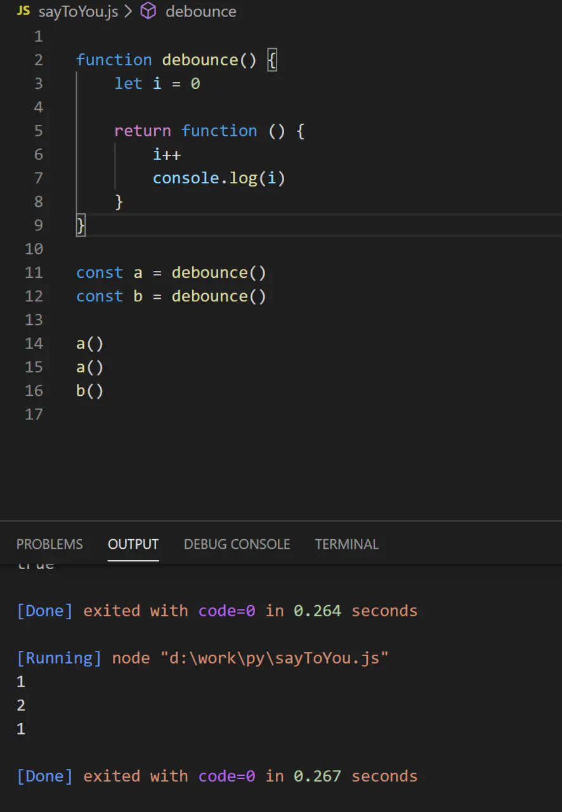

> 我们多写了一个b函数，然后执行的地方改成执行两次a，一次b。

得到的结果是 1 2 1

这说明了什么？

> 说明了每次外部函数执行的时候，外部函数的引用地址不同，都会重新创建一个新的地址。

那既然a和b引用的地址不同，那么它们就会各自拥有一个闭包变量i（是不同的地址）

所以当执行完两次a函数后，a所引用的地址中的内部变量i为2，接着执行b函数，不要天真的认为此时i是2，其实这个时候b所引用的地址中的内部变量i是0，所以执行完b函数将要输出的是1。

> 思考1  console.log(a === b)

那么，我们将上面代码小小的改变一下：


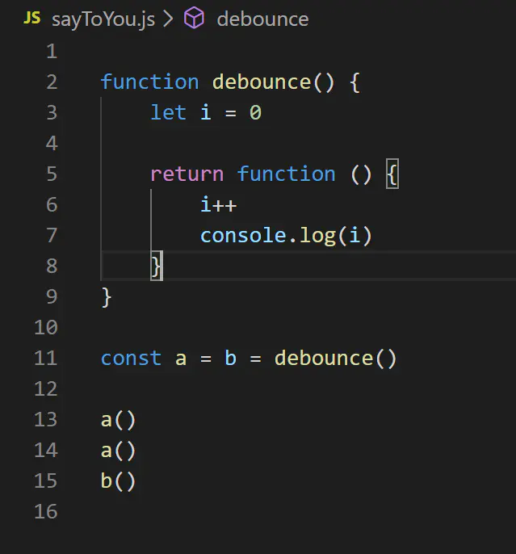

这个时候，控制台要输出什么？你知道答案吗？

> 思考2 console.log(a === b)


### 7.5 那你的防抖函数好像和市面上的不同啊！？

> 那么这一小节，我们将继续优化咱们的防抖函数，努力让它称为你想要的样子！

市面上的防抖函数好像是这样用的嘛：
```js
const sayHello() {
    console.log('hello')
}
const a = debounce(sayHello, 1000)
// 输出 hello
a()
```

这有何难？咱们把闭包的本质都理解的差不多了，传两个参数进去而已，不在话下！

来，让我们看下，第一个参数为一个函数的地址，第二个参数为延时的时间。

```js
// 火影1代
function debounce(fn, delay) {
    let timer = 0

    return function () {
        if(timer) {
            clearTimeout(timer)
        }
        timer = setTimeout(fn, delay)
    }
}

const sayHello = () => console.log('hello, every body!' )
const a = b = debounce(sayHello, 1000)

a()
a()
b()
```
我们通过设置两个参数，就貌似达到了市面版的效果，运行后也只有一句欢迎信息。

但是，如果我的sayHello函数并不是直接输出一句话，而是在调用的时候传一个name进去，这个时候怎么办呢？


嗯？好像可以继续优化：

```js
// 火影2代
function debounce(fn, delay) {
    let timer = 0

    return function () {
        if(timer) {
            clearTimeout(timer)
        }
        timer = setTimeout(() => {
            fn(...arguments)
            clearTimeout(timer)
        }, delay)
    }
}

const sayHello = name => console.log(`hello, ${name}!`)
const a = b = debounce(sayHello, 1000)

a('jcok')
a('lili')
b('cat')
```
改动点：
- 1.这里我们将sayHello改造了一番，让它可以支持传入一个name，并且输出欢迎信息。
- 2、在防抖函数内部，fn执行的地方，通过解构arguments这个全局变量拿到sayHello传入的变量。（可能有萌新对这个arguments很陌生，还有对...arguments这样的语法感到疑惑，这里推荐你去练个手，多打印几次arguments就大概明白了。至于解构也就是三个点号...这部分内容属于ES6，自行查看）

最后我们高频抖动了三次，分别传了jock，lili，cat三个名字进去，最后只会打印出在1000毫秒内最后被触发的那一个，也就是打印hello, cat!

让我们运行一下：

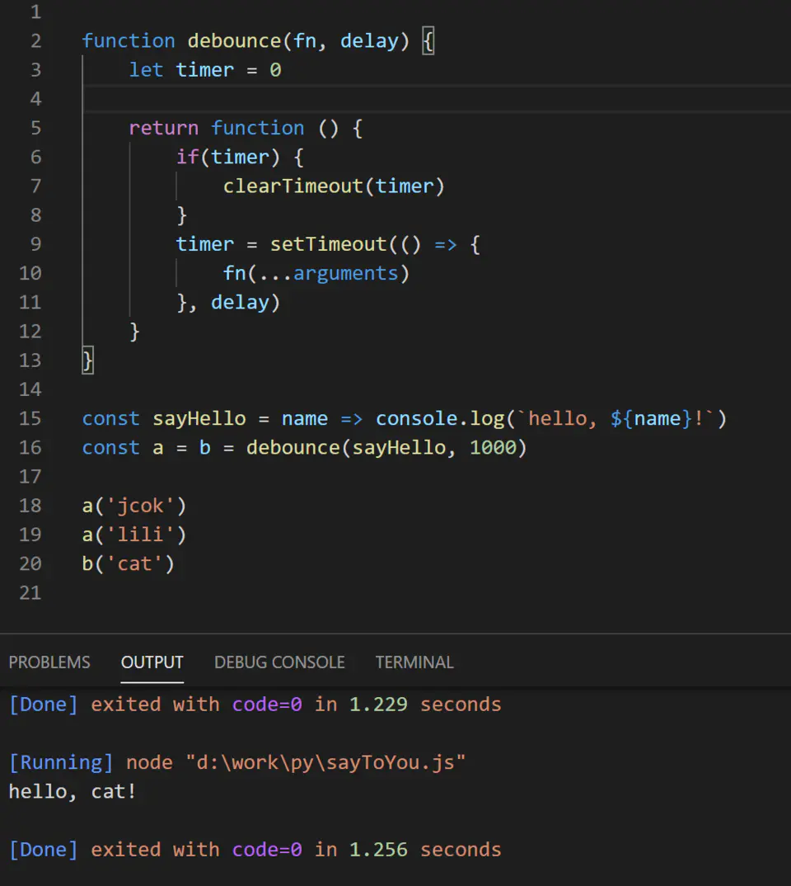

事实上，结果跟我们想要的完全一致。

做到这里，你以为就完了吗？？no，实际上跟市面上的版本还少了一个**this**的指向。

我们这里的sayHello函数默认是挂载在window对象身上的，所以没有在fn中修正指向，也是可以正常运行的。

但是，防抖函数是用于很多地方，如果你没有正确的修正this的指向，那么可能会有bug产生。

来个实际的例子：
```js
function debounce(fn, delay) {
    let timer = 0

    return function () {
        if(timer) {
            clearTimeout(timer)
        }
        timer = setTimeout(() => {
            fn(...arguments)
            clearTimeout(timer)
        }, delay)
    }
}
const obj = {
    name: 'god',
    sayHello: function () {
        console.log(`hello, ${this.name}!`)
    }
}
const a = debounce(obj.sayHello, 1000)
a() // hello, undefined!
```
修改点：
- 1.将sayHello函数写入到一个对象obj身上。（这里注意，不能再用箭头函数了）

你会发现，运行程序后，输出的竟然是hello, undefined！(*这里测试方便是在NodeJs 环境中执行的，可实际上NodeJS中没有document和window。*)

而你不相信，单独运行一次obj.sayHello()，得到的输出是hello, god!

这里就是因为在debounce中调用fn的时候，this的指向默认是window，而window对象没有name的属性，所以，将打印的是hello, undefined!

如果你不相信，那么我们将在window身上挂载一个name属性叫做john，然后执行程序试试。

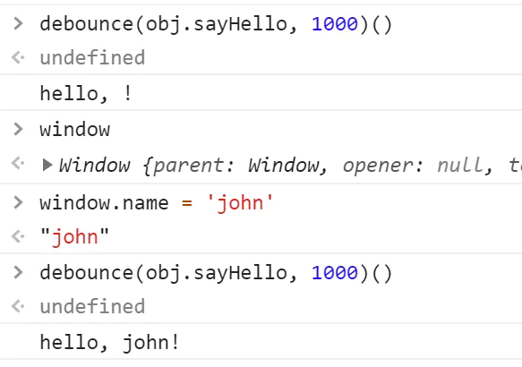

保持debounce和obj的代码不变：

1.先执行一次debounce(obj.sayHello, 1000)()

得到的结果居然是hello,  ! 我愣了两秒，反应过来，可能window对象上已经有了一个name属性为''， 所以，我把window打印了一下：

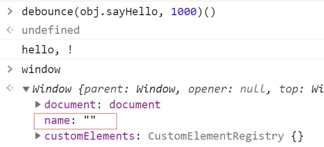

果然，和我推测的一样，那就没毛病了，如果我们在sayhHello中打印的不是name，而是一个window身上没有的属性，将会输出的应该是我们之前推测的hello, undefined!

2.接着修改window.name属性为'john'

继续调用一下debounce(obj.sayHello, 1000)()，得到的结果是和我们预测的一致：hello, john!


> 所以，得出的结论与我们推测的一致，最后我们还需要去修改this的指向。

### 7.6 较为完整一个防抖函数诞生

```js
function debounce(fn, delay, _this) {
    let timer = 0
    return function () {
        if(timer) {
            clearTimeout(timer)
        }
        // 这一句很关键
        const that = _this ? _this : this
        timer = setTimeout(() => {
            fn.apply(that, arguments)
            clearTimeout(timer)
        }, delay)
    }
}
const obj = {
    name: 'god',
    sayHello: function () {
        console.log(`hello, ${this.name}!`)
    }
}
const a = debounce(obj.sayHello, 1000, obj)

a() // hello, god!
```

这里注意我们必须要主动传入这个obj这个作为当前上下文给fn去apply这个this，不然即使我们使用fn.apply(this, arguments)这样去修正this指向，但是得到的结果仍然和你想要的不一致。


```js
const that = _this ? _this : this
```
> 如果你不显式地传入一个上下文，那么默认使用当前上下文。

换句话说就是debounce的return最终执行的环境的当前上下文会作为默认上下文传入该that中，然后去修正fn的this指向。（没有主动传入一个上下文的情况下）

这里很多小伙伴会疑惑了，大家不妨可以试一下。


### 7.7 一个更为完整的测试案例
```js
function debounce(fn, delay, _this) {
    let timer = 0
    return function () {
        if(timer) {
            clearTimeout(timer)
        }
        const that = _this ? _this : this
        timer = setTimeout(() => {
            fn.apply(that, arguments)
            clearTimeout(timer)
        }, delay)
    }
}

const obj1 = {
    name: 'obj1',
    sayHello: function () {
        console.log(`hello, ${this.name}!`)
    }
}
const obj2 = {
    name: 'obj2',
    a: debounce(obj1.sayHello, 1000)
}
const obj3 = {
    name: 'obj3',
    a: debounce(obj1.sayHello, 1000, obj1)
}
const a = debounce(obj1.sayHello, 1000)
const b = debounce(obj1.sayHello, 1000, obj1)

obj1.sayHello() // 没有使用防抖优化

obj2.a() // 使用了防抖优化，默认上下文为obj2

obj3.a() // 显式的改变上下文为obj1

a() // 使用了防抖优化 默认上下文为window（在浏览器环境中）

b() // 显式的改变上下文为obj1

```

> 大家可以测试下上面的代码，看看输出情况和我上面分析的对不对。


## 8总结

> 一句话概括：JS博大精深，岂是我等宵小之辈可以觊觎！？


## 后话

> 我是小呆，欢迎你与我讨论技术。