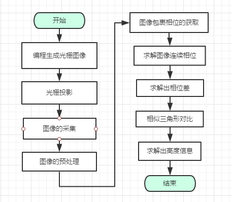

# 快速上手

::: warning 注意
请确保你已经阅读过相应的原理，并且有了一定的理解。
:::

[[toc]]

## 系统搭建

本系统分为两大部分：
- 第一部分是一台投影仪和一台计算机。投影仪型号为LG HW300G - JE，分辨率为1200*800，亮度300流明。通过投影仪将在计算中通过matlab编程生成的正弦光栅图像投影到被测物体上。
- 第二部分是CCD相机通过USB2.0与电脑连接去采集图像。CCD相机型号为MER-132-30UC，接口是USB2.0，采用CCD传感器芯片，外形很小，分辨率1292"964，像素尺寸3．75um，全分辨率最大帧率30帧每秒，支持GENICAM接口，可以直接连接HALCON软件，是一款适用于工业检测的高性价的相机。

> 由CCD采集投影到被测物的受到光栅调制后的图像传输到计算机中，由计算机对采集到的光栅图像进行相应算法处理，最终得到被测物的三维信息。

### 硬件系统

理想的硬件搭建图：

实际：

### 软件系统

可以分为以下：

- MatLab生成光栅图像
- 光栅的投影
- 图像的采集
- 图像的预处理
- 图像包裹相位的获取
- 图像连续相位的获取
- 求解出相位差
- 相似三角形对比
- 高度信息的获取

## 分析

- 1.搭建了一个[交叉光轴](./phase-m-p.md#基于相位轮廓术的三维检测的原理)的实验平台
- 2.光栅投影
- 3.相位轮廓术

## 持续产出中 <Badge text="2019.10.24"/>