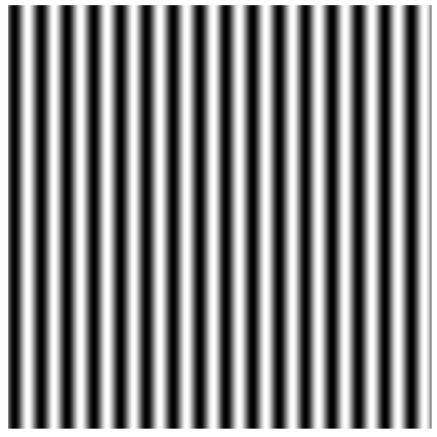

# 光栅条纹生成的原理

光栅条纹是根据**干涉原理**产生的，因为人类的双眼中存在像差，经过大脑的计算产生出立体的图像。

::: tip 提示
本步骤需要在matlab中进行
:::

[matlab中文论坛](https://www.ilovematlab.cn/)<Badge text="推荐"/> 

## 生成正弦光栅的代码

```matlab
clc;close all;clear all;
suffix = 0
% 生成一个长度为4的数组h,储存图形句柄
h = zeros(1,4) 
for k = 1:1:4
f = 1/32;
    for i = 1:512
        for j = 1:512
            % 生成正弦光栅，相位pi/2
            Img(i,j) = 0.5+0.5*cos(2*pi*f*j + pi*suffix/2);
        end
    end
    % figure产生一个图形句柄并赋值给h（k），imshow画一个图像在此句柄
    h(k) = figure;imshow(Img, []);
    fileName = ['sin',int2str(suffix)] %文件名，使用[]拼接字符串
    % 保存在相对路径img文件下
    print(h(k), '-dpng', '-r200', ['img\', sprintf('%s',fileName)])
    suffix = suffix + 1
end
```

##  正弦光栅图像

相应地，透射系数按余弦或者正弦函数变化的光栅称为正弦（振幅）光栅，本课题需要投射的光源就是**正弦光栅**。

运行以上代码，就会生成如下图所示的图像，本文采取的是 [四步相移法](#) ，所以会生成四张**相位**为pi/2的图像。



