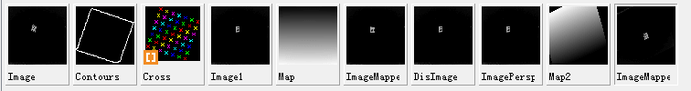

# 相机标定的过程

本课题使用halcon软件对相机进行一个快速的标定，具体过程如下：

- （一）选用标准的标定模板，本实验所用标定板的边长为30mm；
- （二）拍摄标定板在不同姿势下的图像，图像幅数最好不低于8幅，本实验准备了10幅图像，并做了三次实验。

## 标定过程分析

- 第一次实验在普通灯光下的拍摄，发现效果不是很理想。
- 第二次在全黑的环境下，通过额外提供主动光源直射标定板，然后通过摆放不同姿态的标定板下，采集10帧图像，然后进行标定实验，效果明显提升很多。
- 第三次实验，还是在主动提供光源的情况下，通过大幅的变化标定板的位置，然后去采集10帧图像，进行实验，发现有些数据跟第二次实验的不同。

## 预处理

由于本实验使用的标定板的圆点是白色的，背板是黑色的，所以使用了以下两个算子rgb1_to_gray(Image,GrayImage) invert_image (GrayImage, ImageInvert)将图像先转成灰度图像，然后再进行黑白像素点的相互转化

### 初始图像

### 转化后的图像

::: tip 提示
标定过程的代码分析可能很多，但要耐心仔细看哦。
:::

## 标定过程

首先确定好相机的参数和镜头的参数，本实验使用的相机是大恒图像提供的型号是MER-132-30UC的USB2.0的彩色CCD相机，最大分辨率为1292x964，像素尺寸为3.75um x 3.75um。而镜头是computer工业化聚焦镜头，它的主要参数为2/3的尺寸，8mm的焦距，1:1.4的光圈。

- （1）使用gen_cam_par_area_scan_division算子将相机的内参输入进去，生成一个StartCamPar对象。
- （2）使用标定板描述文件，本实验采用的标定板是30mm的，所以使用的是caltab_30mm.descr的描述文件。
- （3）使用create_calib_data算子去创建一个新的标定数据的对象。
- （4）使用set_calib_data_cam_param算子和set_calib_data_calib_object算子，去设置标定板模型中的相机外部参数和标定板描述文件。
- （5）读取拍摄好并经过处理的一组（10张）标定板图片，使用find_calib_obj ect算子先对图片进行高斯滤波找到圆心，然后对图像进行接着阈值分割将标定板的区域找出来后，使用get_calib_data算子和get_calib_data_observ_points算子得到圆点的矩阵参数每一帧的pose参数（外参），使用get_calib_data_obse rv_contours算子得到外边框。
- （6）当一组图片都处理完了之后，调用calibrate_cameras算子得到平均投影误差Error，调用get_calib_data算子得到校正以后的相机内参和外参。
- （7）将标定得到的相机外参CamParam和相机外参CalobjPose作为参数输入到算子change_radial_distortion_cam_par中，采用adaptive模式去修正径向失真，调用的算子是change_radial_distortion_cam_par。
- （8）根据上一算子得到的修正以后的CarParamVirturalFixed参数，然后调用gen_radial_distortion_map算子去生成一个投影的贴图，根据径向失真去得到相应的图像映射map。然后使用这个生成的map去矫正图像，使用是map_image算子处理得到ImageMapped的图像。
- （9）计算像素的距离，首先设定两个像素点image1（x1，y1）和image2（x2，y2），他们间距为一个固定值，然后通过image_points_to_world_plane算子将这两个像素点转换成世界坐标系的两个点world1（x1,y1）和world2（x2，y2），接着通过distance_pp算子去计算出世界坐标系中两个点world1和world2之间的距离DistanceWorld，同样也通过这个算子计算出图像坐标系的两个点image1和image2之间的距离DistanceImage。最后计算出每个像素对应的世界坐标系中的距离DistanceOnePixel等于DistanceWorld除以DistanceImage和每毫米对应的世界坐标系的距离DistanceOneMilimeter等于DistanceImage除以DistanceWorld。因为考虑到标定板的厚度为3mm和固定标定板的软胶厚度为2mm，所以在进行上述步骤之前，首先用算子set_origin_pose将标定过后得到的CalobjPose外参的z轴除去5mm，得到新的PoseNewOrigin外参。
- （10）计算出中心偏移距离OffSetX与OffSetY，然后通过然后通过算子tuple_replace替换相机外参中的一个数据得到新的外参PoseCalibRot，接着通过算子set_origin_pose把中心偏移距离OffSetX和OffSetY和PoseCalibRot代入之后，设置新的世界坐标系，得到矫正了径向畸变与视角畸变的相机外参PoseNewOriginFinal，之后通过gen_image_to_world_plane_map算子生成投影贴图，得到图片平面与世界坐标系的平面之间的映射关系的对象map2，最后通过map_image算子去矫正图像，得到新的图像。

## 标定结果

经过多次实验，得到标定板的边长信息如下：

|直线像素长度（单位：像素） | 转化后的边长（单位：mm）| 误差|
| ----------------------- | --------------------- | --- |
|91.8329|	30.07mm|	0.233%|
|90.8034|	29.74mm|	0.867%|
|90.6055|	29.67mm|	1.1%|
|91.1976|	29.87mm|	0.433%|
|90.9700|	29.79mm|	0.7%|
|91.2943|	29.90mm	0.333%|
|91.3347|	29.87mm|	0.433%|
|平均误差|	0.585%|	|
|平均方差|	1.6595%| |	

### 标定板的边长信息图

### 图像变量窗口图

### 标定过程图

### 变量窗口图

