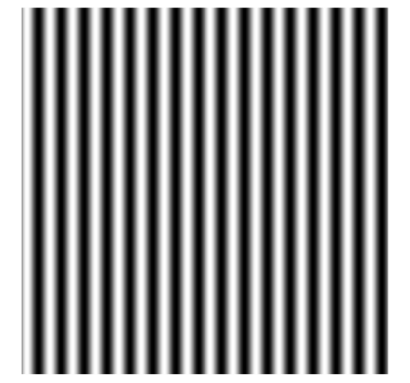
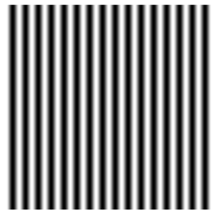
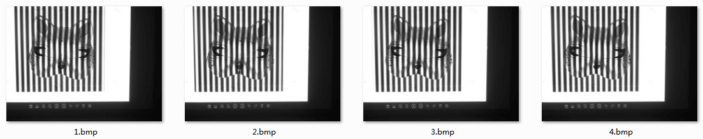
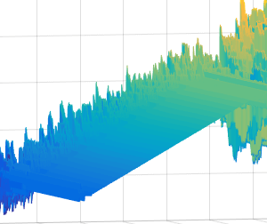
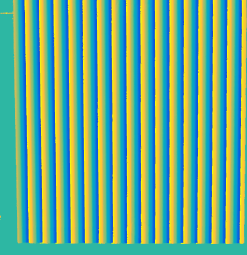
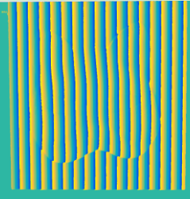
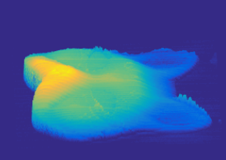

# 实验过程

## 生成光栅

> 首先用matlab编程生成空间频率（f）为1/32，背景光强为0.5，条纹对比度为0.5的，相位为pi/2正弦光栅，因为本实验采用是四步相移法，所以一共需要生成四张光栅图像。

### 代码如下

```matlab
clc;close all;clear all;
suffix = 0
% 生成一个长度为4的数组h,储存图形句柄
h = zeros(1,4) 
for k = 1:1:4
f = 1/32;
    for i = 1:512
        for j = 1:512
            % 生成正弦光栅，相位pi/2
            Img(i,j) = 0.5+0.5*cos(2*pi*f*j + pi*suffix/2);
        end
    end
    % figure产生一个图形句柄并赋值给h（k），imshow画一个图像在此句柄
    h(k) = figure;imshow(Img, []);
    fileName = ['sin',int2str(suffix)] %文件名，使用[]拼接字符串
    % 保存在相对路径img文件下
    print(h(k), '-dpng', '-r200', ['img\', sprintf('%s',fileName)])
    suffix = suffix + 1
end
```

### 代码解析

> 首先设定空间频率f为1/32，然后设定图像边长为512像素的图像，背景光强为0.5，光栅对比度为0.5，每次位移的相位为pi/2，经过运行生成以后，得到以下四张图片。

#### 相移为0的光栅图像


#### 相移为pi/2的光栅图像


#### 相移为pi的光栅图像



#### 相移为3pi/2的光栅图像



### 操作

然后通过数字投影仪投射到被测物体上，通过HDevelop软件调用相应的算子进行图像的采集。


## 图像的采集和预处理

> 打开HDevelop软件，首先先进行上一章节所述的相机标定，将标定后的相机内参和外参设置好，然后在程序窗口中调用相应的算子去打开相机然后拍摄图像和处理。主要步骤如下：

- ⑴调用open_framegrabber算子去打开型号为MER-132-UC的CCD相机。
- ⑵接着调用grab_image_start算子去获取句柄。
- ⑶然后调用grab_image_async获取句柄中的图像。
- ⑷使用rgb1_to_gray算子把采集到的图像转化成灰度图像。
- ⑸使用gen_rectangle1算子画出一个ROI。
- ⑹配合reduce_domain算子切割ROI，排除其他干扰。
- ⑺调用write_image算子把处理好的图像保存在计算机中。
- ⑻最后调用close_framegrabber算子关闭计算机对相机的连接。

### 被调制后的狐型面具



### 光栅背景图


## 求解出包裹相位和解包裹（unwrap）

> 打开matlab软件，然后在编辑器内使用如下步骤：

- ⑴使用imread函数读入4帧背景图像，并保存在变量中。
- ⑵使用imresize函数对读入的图像进行双线性插值，入参为bilinear。
- ⑶使用double函数将其转化为双精度型数据，并且使用size函数获取图像的大小M和N。
- ⑷使用atan2函数反正切函数将计算出背景的包裹相位original_phase。
- ⑸使用unwrap函数先对物体进行列解卷，然后再将得到的结果进行行解卷，最后得到背景的连续相位数据unwrapped_org。

重复以上步骤，对物体进行连续相位的求解得出unwrapped_phase。
将物体的连续相位数据与背景的连续相位数据进行相减运算，得到相位差数据delta。

### 反正切函数代码

```matlab
wrapped_phase = zeros(M,N);
for j=1:N
    for i=1:M
        wrapped_phase(i,j)=atan2(I4(i,j)-I2(i,j),I1(i,j)-I3(i,j));   
    end
end

original_phase = zeros(M,N);
for j=1:N
    for i=1:M
        original_phase(i,j)=atan2(bI4(i,j)-bI2(i,j),bI1(i,j)-bI3(i,j));   
    end
end
```

### 解包裹代码

```matlab
unwrapped_org= unwrap(original_phase,pi,2); % 衬底列解卷
unwrapped_org= unwrap(unwrapped_org,pi);    % 衬底行解卷

unwrapped_phase= unwrap(wrapped_phase,pi,2);    % 物体列解卷
unwrapped_phase= unwrap(unwrapped_phase,pi);    % 物体行解卷
```

### 相位差计算代码

```matlab
delta = unwrapped_phase-unwrapped_org; % 相位差
```

### 包裹相位与解包后的相位对比

#### 纵向包裹相位图


#### 纵向解包后的相位图



#### 背景相位图俯视图



#### 被测物体相位俯视图




## 求解出相位差并还原高度信息

```matlab
L = 73;
d = 19.5;
AC = 16 * delta / pi;
H = (AC*L/d)./(1+AC/d);
```

### 求解出的相位差图像与手型模型恢复图

#### 相位差图



#### 恢复图


## 误差分析

- ⑴由于LG hw300-JE投影仪的限制，不够专业，是便携式的，分辨率不够高，流明不够高，接口传输不够清晰，所投影出来的正弦光栅图像达不到要求。
- ⑵由于彩色CCD相机，型号为MER-132-30UC的相机拍摄的图像不够清晰，拍摄的图像有阴影部分，会影响到相位的计算，暂时没有解决的办法。
- ⑶由于构建的实验系统是交叉光轴的方式，相机的镜头和投影仪的镜头没办法实现在完全的同一水平线上，在进行相似三角形计算的时候，最终计算出的数据也会有误差。
- ⑷在标定的过程中，由于人为因素，所导致最终的结果会出现偏差，比如不小心移动了一点点标定好的设备位置，在旋转镜头的通光口大小的时候，导致位姿出现了偏差等人为因素的干扰，也会导致误差。