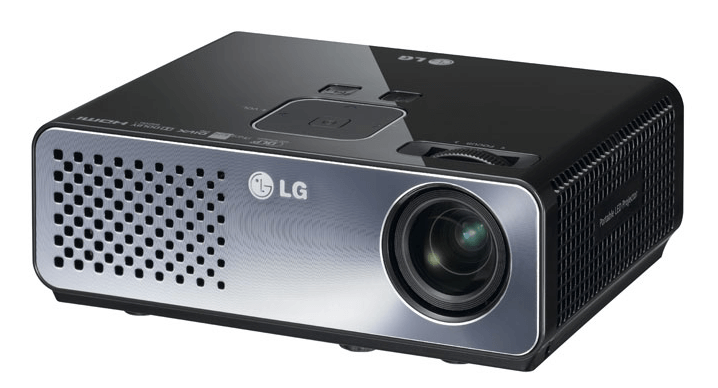

# 硬件系统

本实验搭建的检测系统的硬件由一台数字式投影仪、一个CCD相机及镜头、一台计算机、一个测量模型和一块标定板组成。

## （1）CCD相机和镜头

CCD相机的传感芯片是CCD的，支持USB2.0传输的数字摄像机。镜头也是由大恒图像提供的一款焦距是8mm的镜头，最远照射距离可达20m，照射角度是40度。

### 相机参数：

| 名称 | 参数 |
| ------------- |:-------------:|
|型号|	MER-132-30UM/UC|
|分辨率|	1292(H) x 964(V)|
|帧率|	30fps|
|传感器类型|	CCD|
|像素尺寸|	3.75um x 3.75um|
|光谱|	黑白/彩色|
|数据接口|	MiniUSB2.0|

### 镜头参数：

| 名称 | 参数 |
| --- |:---:|
|焦距|	8mm|
|最大对焦比|	1:1.4|
|可视角度|	80度|
|最远距离|	20m|

## （2）投影仪

投影仪的型号为LG HW300-JE，是一款便携式的数码光显投影仪，支持vga，hdmi等多种接口。

### 投影仪参数

| 名称 | 参数 |
| ------------- |:-------------:|
|亮度	|300流明|
|对比度	|2500:1|
|灯泡类型	|LED|
|分辨率	|1280 x 800|
|比率	|16:10|
|投影距离	|0.59m-3.00m|
|帧率	|30|
|支持接口	|HDMI、VGA|

## （3）计算机

计算机屏幕的分辨率为1920x1080，大小为23寸。

### 计算机参数

| 名称 | 参数 |
| ------------- |:-------------:|
|显卡|	GTX 730，显存（4G）|
|内存|	8G|
|CPU|	Intel Core I7-7700|

## 分析

硬件系统的布局十分关键，一点点的位置偏移都可能导致最终结果误差偏大，所以总结以下几点注意事项：

- (1)因为要检测的物体是确定的，所以在拍摄的时候，背景可以设置在墙壁上，如果有条件的话，可以在墙上挂一块纯色平整的布，以最大程度上减少背景的影响。
- (2)由于采用的交叉光轴的方式，投影仪的镜头和相机镜头要尽量保持在同一水平上，投影仪与相机之间的距离也不可以太远。
- (3)被测物体要尽量保持在镜头中心位置，不能超出整个图像画面。

