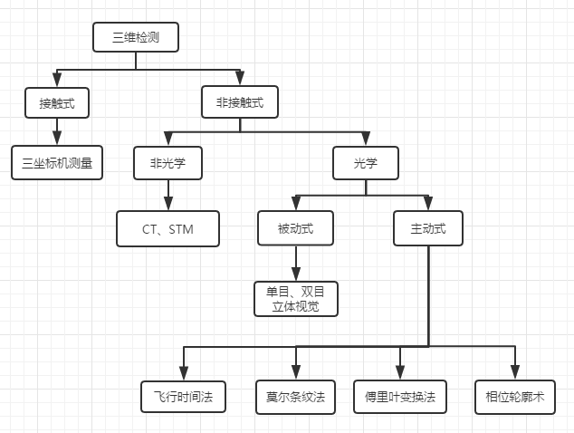

# 三维检测技术方法的概述

三维检测技术主要分为**接触式检测**和**非接触检测**两大类[4]。

接触式检测方法需要和被测物体表面接触，但是在被测物体表面较为不规律的情况下，很难进行准确的检测，不仅限制了检测的场景且不能检测柔软的物体，同时还存在容易对待测物体造成损失、大型物体检测的速度较慢、设备成本昂贵等缺点，在精度和速度上渐渐被淘汰了。
非接触式检测技术不再与物体表面接触，需要用到的媒介是光。而非接触式检测技术主要用到的方式是光学三维检测技术。光学三维检测技术特点主要是通过光线照射到物体表面，然后通过漫反射和反射得到物体的表面信息的三维空间坐标点。光学三维检测技术根据是否主动提供光可以区分为两大类：主动和被动式。
## 立体视觉法（Stereoscopic vision method）
立体视觉法（Stereoscopic vision method）是属于主动式三维检测方式的一种具有代表性的方法，其原理是通过拍摄多帧不同视角的图片，然后通过相应的算法去处理并合成物体三维信息。它的优点是对相机硬件设备等要求低，成本也很低，且由于直接根据环境光去采集图像，所以室内、室外都能可以适用。与之而来的缺点也很明显，因为十分依赖环境中的自然光线去采集图像，一旦受到光照角度发生变化、光照强度发生变化等环境因素的影响，拍摄出的两张图片亮度信息差别十分大，这会对匹配算法造成很大的挑战。并且受到了相机的基线限制，从而限制了测量范围，在一定程度上也限制了该深度相机的深度信息的采集。
## 飞行时间法（Time of flight）
飞行时间法（Time of flight）的原理是使用发射器给发送激光到被测物体表面，在接收端采集从被测物体表面返回的光，最后计算激光的飞行时间来得到被测物体的距离信息。Time of flight的优点是能够快速的对目标物体的识别与追踪，利用此特点在手机的前置摄像头中可以使用这个模块进行人脸识别。而且它的配件成本相对低廉，借助于CMOS的特性，对复杂物体的姿态判断极为有效。它的缺点是受到了硬件发展的限制，更新换代速度较快，且测量的距离受限，一般只能10米以内，容易受到环境光线的干扰。
## 莫尔条纹法（Moire fringe method）
莫尔条纹（Moire fringe）是在一个固定的角度和频率下，两条线发生干涉时产生的。莫尔条纹法将主光栅和基准光栅两组光栅投影到待测物体表面，通过对比基准光栅和主光栅之间的条纹[1]，然后通过计算机去处理条纹信息并得到物体表面的三维信息。莫尔条纹法的优点是系统整体运行时间较短且最终的精度很高。它的缺点是这种方法要与待测物体距离较小，因而莫尔条纹法只能适用在物体体积较小的检测上。
## 傅里叶变换轮廓术（Fourier transform profilometry）
傅里叶变换轮廓术(Fourier transform profilometry)使用周期性模式中的失真来测量物体的轮廓信息，该方法使用傅里叶分析去判断出曲折表面上的局部坡度。Fourier transform profilometry的突出优势是在检测过程中仅仅只需要投影一帧图片，即可以计算出物体表面的高度分布信息。FTP的优点是测量速度快、设备简单。而与之同时带来的问题是由于FTP的算法复杂，计算量大，由于混入的混频等因素会引起的误差，检测的精度有待提高。
## 相位轮廓术（Phase measurement profilometry）<Badge text="beta" type="warn"/>
相位轮廓术(Phase measurement profilometry)的原理是通过计算3张以上背景的连续相位与物体的连续相位之间的差值，然后通过测量的数据再计算出物体的高度信息。该方法在是通过计算每一个点的光强信息再去转化为相位信息，因此不会受到背景光的影响，而Phase measurement profilometry的算法中采用的是减法运算，计算的难度很低，运算的速度很快。

::: tip 相位轮廓术
本文重点研究的就是相位轮廓术中的四步相移法
:::
### 后续更新 <Badge text="0.10.1+"/>
