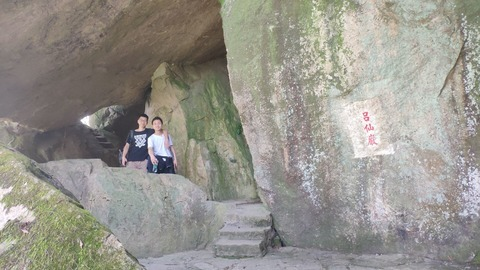
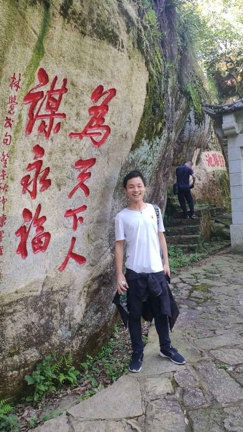
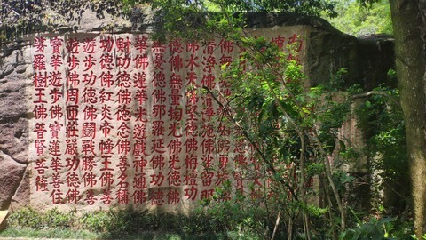
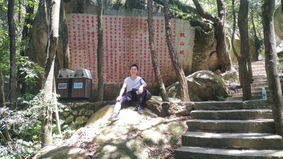

# 前言

这几天五一小长假，5.1和5.2天气都不太好，今天天气格外的给面子呀，正好赶上福州地铁2号线开通了。
# 准备

1.运动包+水壶+帽子
2.拉上几个好基友
3.带上你的手机
# 路线图

7:40分从宿舍出发，去学校北门公交车站坐48路公交==>8点5分到上街地铁口==>乘坐2号线==>9点04分出了鼓山地铁口==>9点10分鼓山山脚下==>上山
估摸着10点出头一些到了鼓山十八景公园南大门吧，在南大门买了3张门票，成人票10元一人，我们带了学生证5元一张。

门票背面画着十八景的路线图啊，对于路痴可能是一个很痛苦的事情。

| 景点 | 名称 | 序号 |
| ------ | ------ | ------ |
| 1.达摩面壁 | 2.南极升天 | 3.仙猿守峡 |
| 4.老鹤巢云 | 5.仙人巨迹 | 6.福寿泉图 |
| 7.蟠桃满坞 | 8.玉笋成林 | 9.蚁艇渡湖 |
| 10.鱼灯普照 | 11.狮子戏球 | 12.金蟾出洞 |
| 13.伏虎驮经 | 14.神龙听法 | 15.铠甲卸岩 |
| 16.慈航架壑 | 17.八仙岩洞 | 18.千佛梵宫 |

本来想去看看**南极升天**的，没成想走错路了，来到了地图上右边这一小块的地方，那就将就着看吧。
第一个看到的应该是**八仙岩洞**

清风明月

在旁边石凳上，拍了个合照

往前走去，有个瑶池啥子的玩意来着
然后在旁边石壁拍了几张

继续往前探去，来到一个路口，听游客说左边的路走不通了，我偏不信还，往左走去，没几步前面断了路，于是返回原路往右达摩洞走去。
到了**达摩洞**，几块巨石巧夺天工，构成了一个不深的洞穴，左边巨石就是达摩面壁的墙壁，洞最里处供奉着几尊菩萨，过于神圣，不敢亵渎，又是乎没有photo
过了达摩洞后又去了**登高台**瞭望整个福州，登高眺远，真有一种**会当凌绝顶，一览纵山小**的feel，海拔大概500多不到600的样子吧。
路上有很多这样的石刻的地图

来到**佛窟**这边

从佛窟出来又到了一个路口

在路口上面有个**鼓山赋**啊，那文采，学富五车

最后去瞟了一眼**一笔成虎**

大概感觉这十八景徒有虚名，都是一些石壁刻字，强行凑了十八个景点出来，但是基于门票如此廉价，我也不好多说什么。
看了一眼时间大概是11点10几分吧，然后往南大门出口走出去。
又到了鼓山十八景公园这边，去了趟洗手间准备下山。
在鼓山站坐地铁到了师大站，12点45分出的师大地铁口，然后去正荣半天妖吃了一顿好的，吃饱喝足已是下午2点。
半天下来，步数一共17k多吧，我的老寒腿啊，下山的时候一直抖。。。。

# 后话

福州两大名山，鼓山旗山，都可以一去啊。抓住大学最后的尾巴，好好的浪一波。

