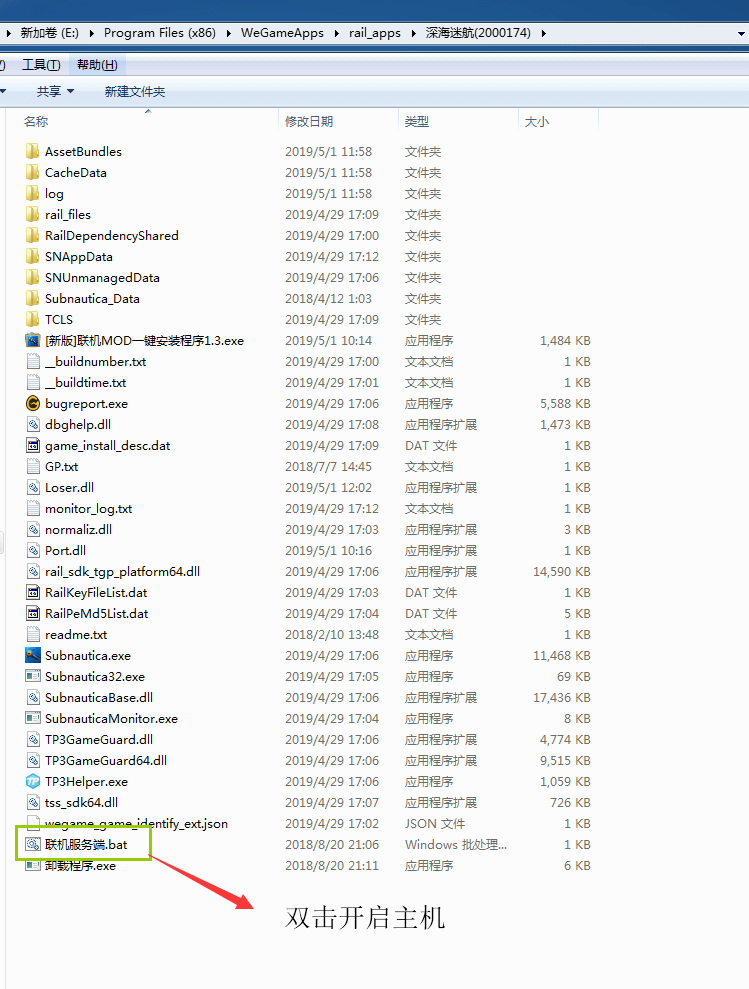
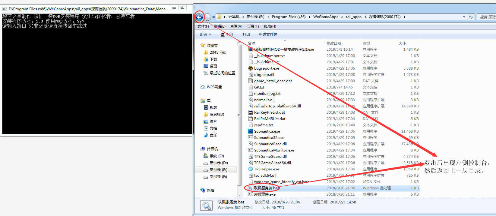
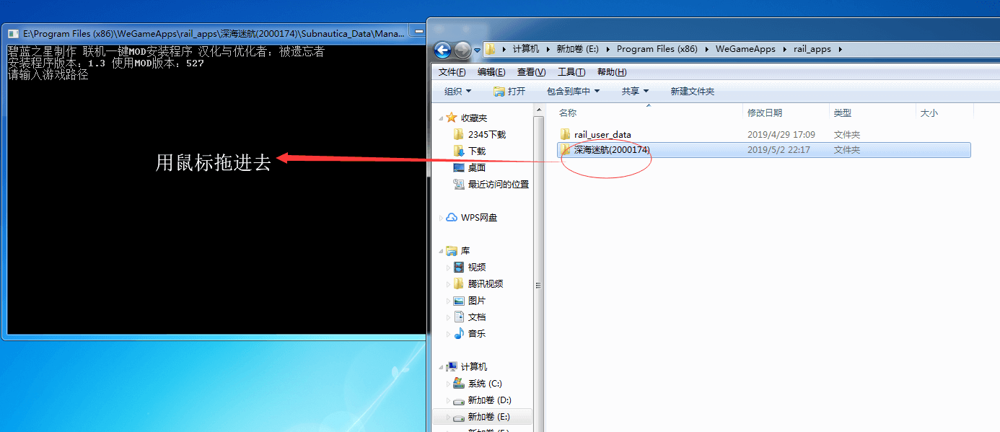
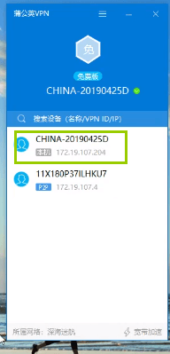

# 深海迷航联机mod教程
## 声明
此联机mod由碧蓝之星提供，使用mod前先关闭所有杀毒软件还有防火墙
## 使用方法
### 1.首先下载一个蒲公英vpn
点击下载安装==>[蒲公英](http://cloud.aboutme.ink/s/YafattpcqtFkB9a)
### 2.注册一个账号
然后注册账号==>[点击注册](https://console.oray.com/passport/register.html)
### 3.登陆
然后登陆蒲公英网站==>[点击登陆](https://console.oray.com)
### 4.进入控制台
来到控制台

### 5.组网
点击智能组网，管理默认网络

设置入网方式为允许任何人加入网络后确认即可，记住你的网络ID，例如下图的是513614009

### 6.打开蒲公英软件
然后来到桌面，打开蒲公英软件后登陆
点击个人头像那里

加入其它网络

点击我知道了

输入网络ID，加入网络

注意只支持3个人组网联机，3个人都必须加入同一个网络ID

### 7.使用联机mod
点击下载安装==>[联机mod-1.3](http://cloud.aboutme.ink/s/dCQDECRP2re2Wyt)
复制到游戏根目录，双击安装后即可开启联机了。

这样你就可以加入别人的房间了，但是你自己无法开启主机（就是自己做主机，别人来连接）

### 8.开启主机建房间
首先关闭window防火墙，自行百度。
找到游戏主目录

双击联机服务端.bat后出现如下页面

黑色控制台上第一步需要输入端口，我们直接按回车使用默认端口就行。
第二步需要你输入游戏目录，我们先在文件中返回上一层目录。

然后拖游戏目录进去

然后去掉引号再按一次回车就可以开启主机了，注意这个黑色的控制台界面不要关闭！！！！
然后叫上你的小伙伴进入你的ip就可以联机，你的ip在蒲公英上有个主机172.xx.xx.xx你复制一下发给好友，注意要处于同一个蒲公英网络下才可以联机，目录蒲公英组网只支持3个人（免费版）

上图框框圈起来的是你的ip，把这个发给好友，可以看到现在蒲公英有两个人，一个是我，一个是我的好友。我们两个人处于同一个局域网，所以可以联机。

### 9.祝你联机愉快，如果有版权问题，请联系我

