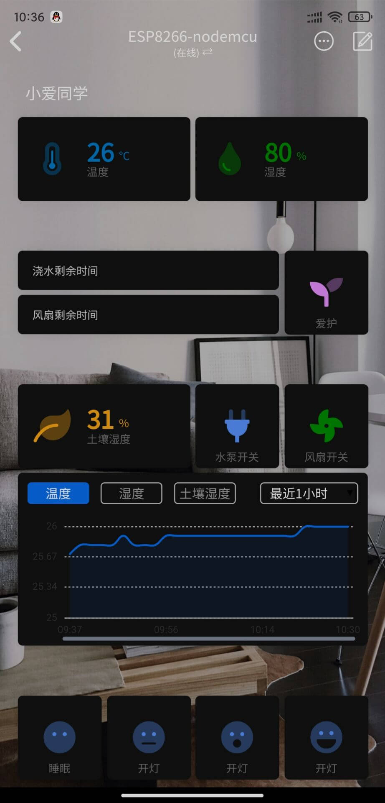

# Lot

## 起航

>这是新的篇章，属于物联网的时代

## ESP8266/32

> 接触物联网的第一块板子，其实不然，在大学的时候的stm32也算吧应该。哈哈。

## Blinker 点灯

> 接触物联网的第一个专业且轻松的物联网解决方案

## 一个小例子

> 温湿度土壤灌溉系统

### 努力更新中 <Badge text="2021.04.17"/> 
:pig_nose:  :pig_nose:  :pig_nose:  :pig_nose: