# ESP32-CAM 推流直播

> 使用esp32-cam进行实时录像，然后通过obs推流到虎牙直播。

## 效果展示

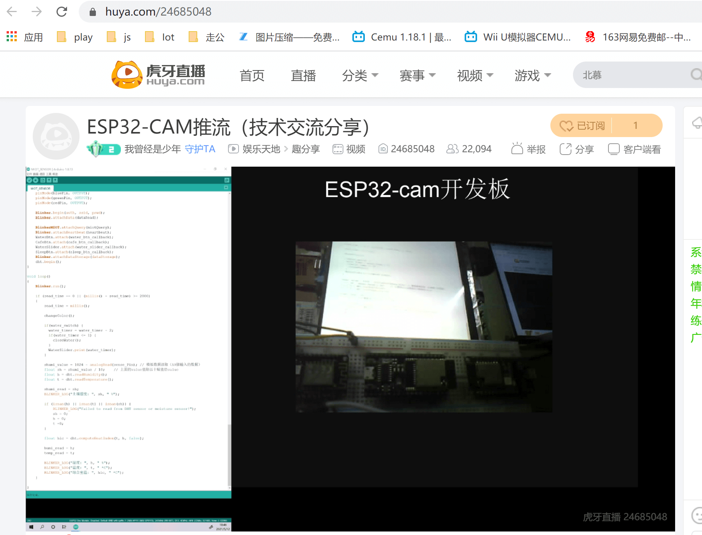

> ps:我的虎牙直播间是24685048，欢迎来点个订阅，虽然没用，哈哈。

## 一、适用人群及软硬件准备

### 1.适用人群

> 本文适合对esp32/8266等有过开发经验的童鞋，作为一个好玩的idea去分享。

### 2.软硬件准备

- esp32-cam开发板
- OBS Studio软件(目前环境：window系统)
- 虎牙直播软件

## 二、烧写代码

### 1.使用esp32-cam的示例代码

> 我是大自然的搬运工，嘿咻...

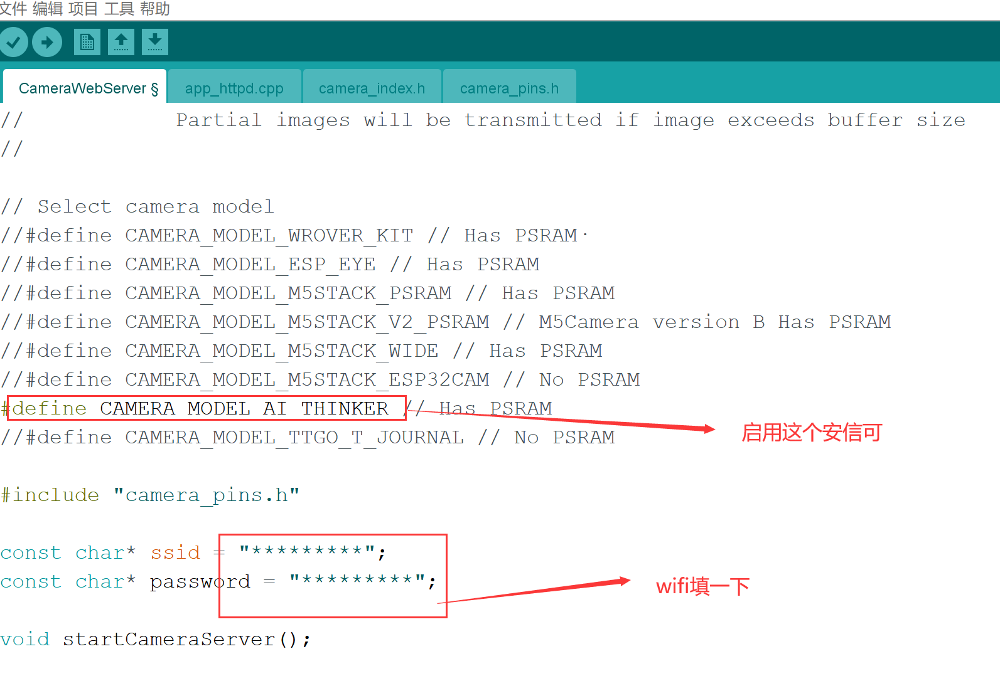

### 2.改一下WIFI信息和定义摄像头模块

> 改成你自己的wifi，模块选择安信可的

### 3.烧写调试

打开浏览器输入串口中打印出的地址即可看到一个界面，如下：

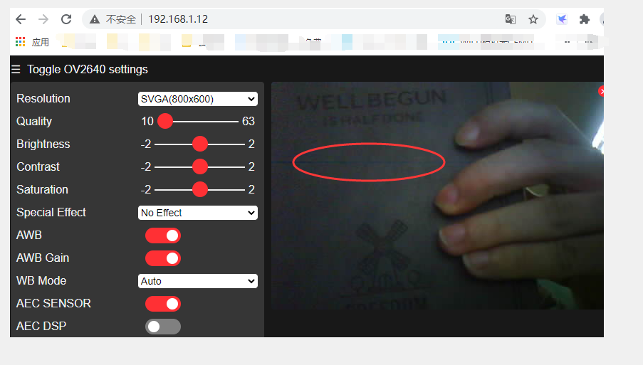

## 三、获取视频流

正常我们打开的ip地址其实是web服务器默认的80端口，但是我们要获取流地址，在串口调试窗口可以看到流地址的信息`Starting stream server on port: 192.168.1.7:81`

但是直接访问`192.168.1.7:81`是没有结果的。

在`app_httpd.cpp`中拉到最底下可以找到一段：
```c++
    Serial.printf("Starting web server on port: '%d'\n", config.server_port);
    if (httpd_start(&camera_httpd, &config) == ESP_OK) {
        httpd_register_uri_handler(camera_httpd, &index_uri);
        httpd_register_uri_handler(camera_httpd, &cmd_uri);
        httpd_register_uri_handler(camera_httpd, &status_uri);
        httpd_register_uri_handler(camera_httpd, &capture_uri);
    }

    config.server_port += 1;
    config.ctrl_port += 1;
    Serial.printf("Starting stream server on port: '%d'\n", config.server_port);
    if (httpd_start(&stream_httpd, &config) == ESP_OK) {
        httpd_register_uri_handler(stream_httpd, &stream_uri); // 这句是注册一个路由处理流的传输
    }
```
接下来找到`stream_uri`实现的地方：

```c++
    httpd_uri_t stream_uri = {
        .uri       = "/stream",
        .method    = HTTP_GET,
        .handler   = stream_handler,
        .user_ctx  = NULL
    };
```

可以看到路由为`/stream`，ok，接着将ip地址+端口+`/stream`输入到浏览器就会看到一个视频在播放了
需要注意的事项是，这个流地址只能被一个客户端占用，再打开一个页面就看不到了。（如果你刚才打开了80端口的页面请先关闭，不然你这个地址是无法传输任何东西的）

视频流地址为：`ip:81/stream`

## 四、打开obs studio软件

### 1.新建一个浏览器源

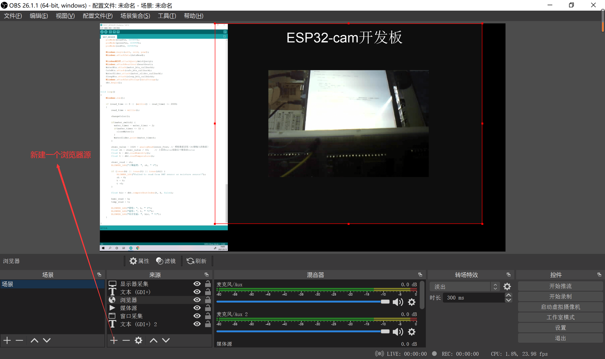

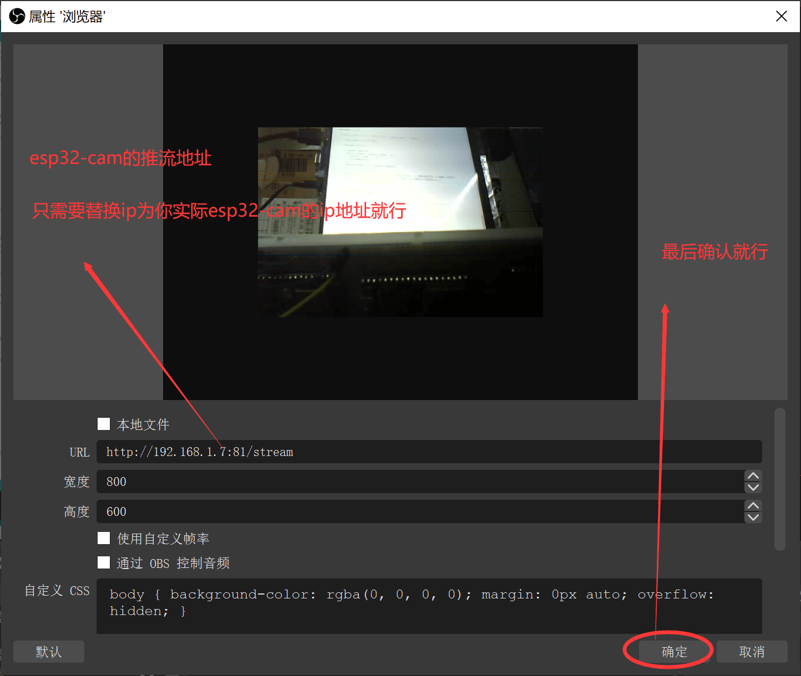

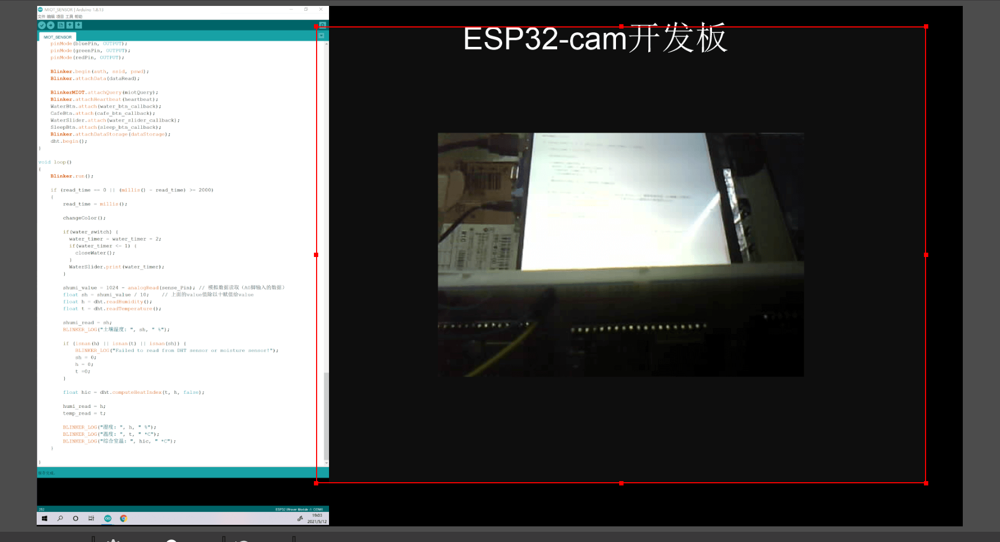

> 一切都ok之后，你的obs studio上就会在播放来自esp32-cam实时直播的视频了，就像上图一样。

### 2.推流地址设置

- 1.打开虎牙直播软件（PC端）
- 2.选择obs推流
- 3.获取串流地址和秘钥
- 4.将这两个参数填写到obs studio里面
- 5.点击设置->推流设置->确定

> 操作过程如下：

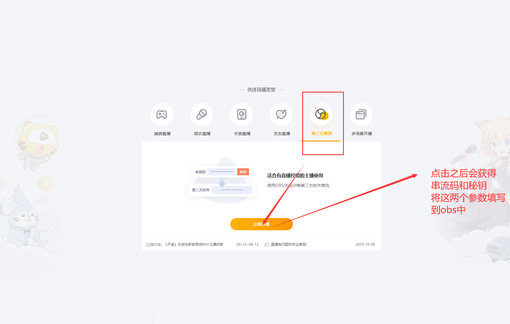

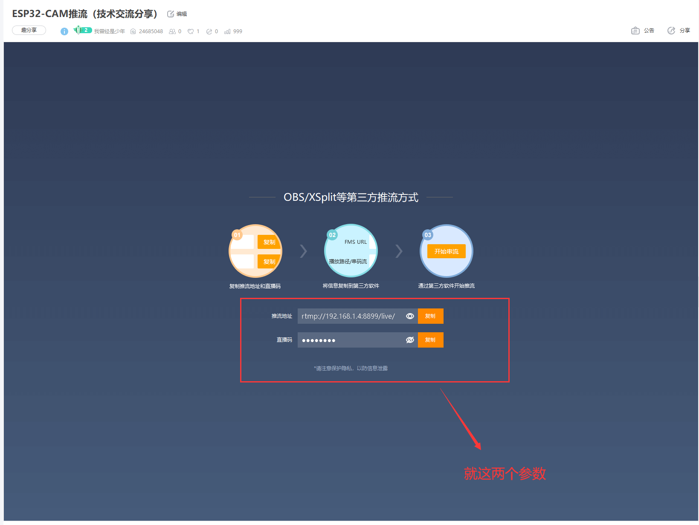

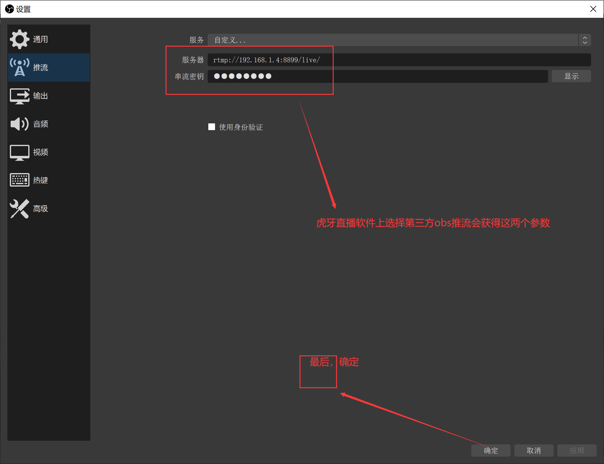

### 3.开始推流

点击`开始推流`按钮

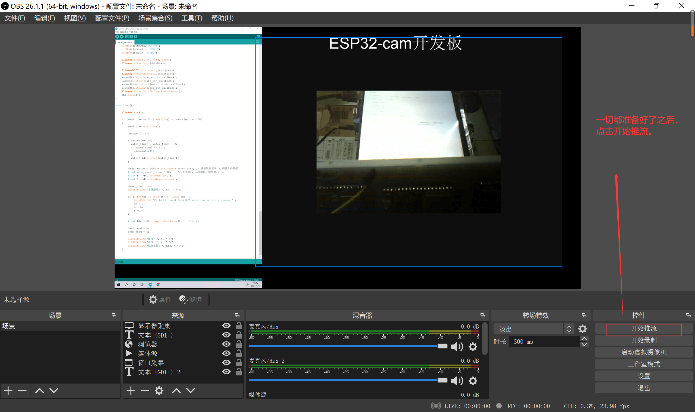

一切ok的话，右下角的显示如下：

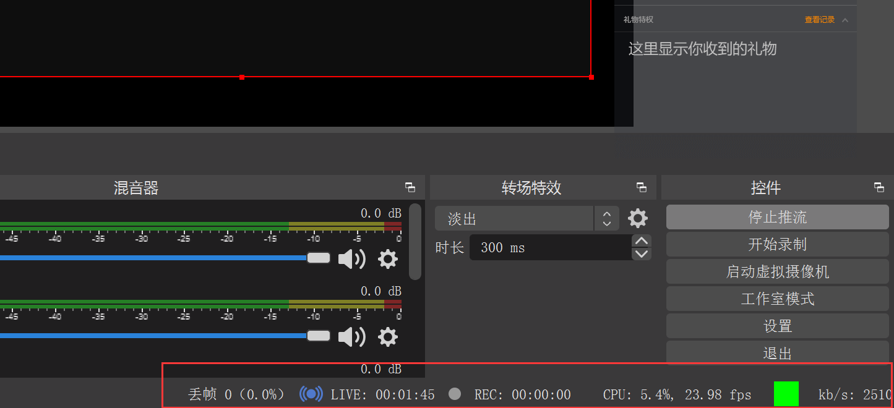

### 4.进入直播间查看

> 一起步骤都ok的话，稍微等个几十秒吧，然后去直播间看看效果


## 五、敬请期待

> 这是我关于esp系列的第一个教程，也算是一个分享吧，其实并没有什么技术含量，只是将积木进行拼接而已。

在写这篇文章的时候我已经有好几个项目正在开发和将要完成了，后续我将会把这几个项目给童鞋们分享一下哈，敬请期待！

TodoList:
- 1.esp8266/32 WS2812 LED 灯项目（进度100%）
- 2.esp8266/32 WEB MQTT客户端（进度80%）
- 3.esp8266/32 WEB Control Center (还在构思阶段)

顺序：接下来我应该会先写出第2个项目的分享，然后写第1个项目，最后将两个项目合起来生成一个ws2812智能灯带的版本放github给大家玩。

## 六、留言

> 如果有什么好的建议和分享或指导都可以踊跃留言哦。再见...~~~~